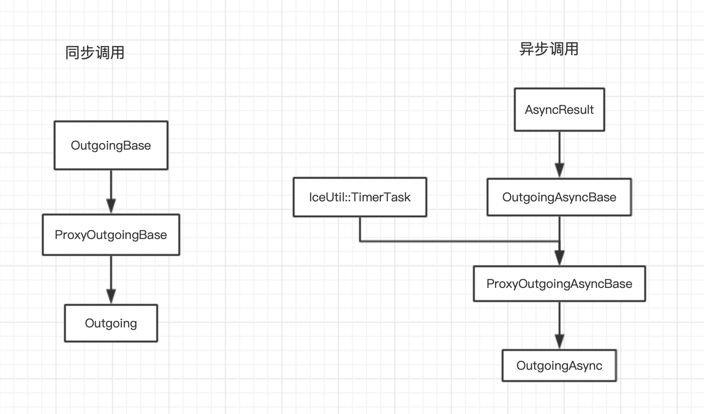

# 1  client 调用流程
---

我们从 slice 文件生成的 proxy 接口开始( ICE 3.6版本，默认的调用是同步的), 代码如下：

```cpp
::Ice::Long
IceProxy::KLive::EnterRoomServer::GetRoomCache(const ::std::string& __p_querystr, ::std::string& __p_resultstr, const ::Ice::Context* __ctx)
{
    __checkTwowayOnly(__KLive__EnterRoomServer__GetRoomCache_name);
    ::IceInternal::Outgoing __og(this, __KLive__EnterRoomServer__GetRoomCache_name, ::Ice::Normal, __ctx);
    try
    {
        ::IceInternal::BasicStream* __os = __og.startWriteParams(::Ice::DefaultFormat);
        __os->write(__p_querystr);
        __og.endWriteParams();
    }
    catch(const ::Ice::LocalException& __ex)
    {
        __og.abort(__ex);
    }
    if(!__og.invoke())
    {
        try
        {
            __og.throwUserException();
        }
        catch(const ::Ice::UserException& __ex)
        {
            ::Ice::UnknownUserException __uue(__FILE__, __LINE__, __ex.ice_name());
            throw __uue;
        }
    }
    ::Ice::Long __ret;
    ::IceInternal::BasicStream* __is = __og.startReadParams();
    __is->read(__p_resultstr);
    __is->read(__ret);
    __og.endReadParams();
    return __ret;
}

```

上面这段代码大致分成 4 部分：

1. 创建 outgoing 对象 (传入Proxy对象): operation mode 是normal模式（默认）
2. 准备参数
3. 发起调用 (3.6版本的这里的调用是同步的，从3.7开始同步调用内部也是用异步实现的)
4. 读取返回结果

其中的核心就是 Outgoing 对象 和 Proxy 对象，下边开始正题。

1. Outgoing类概览

   


Outgoing 类初始化：

1. 设置编码，调用方式，InvocationTimeoutdeadline，准备context等
2. invoke逻辑 (最终调用ProxyOutgoingBase::invokeImpl())
   
   1. 设置状态

