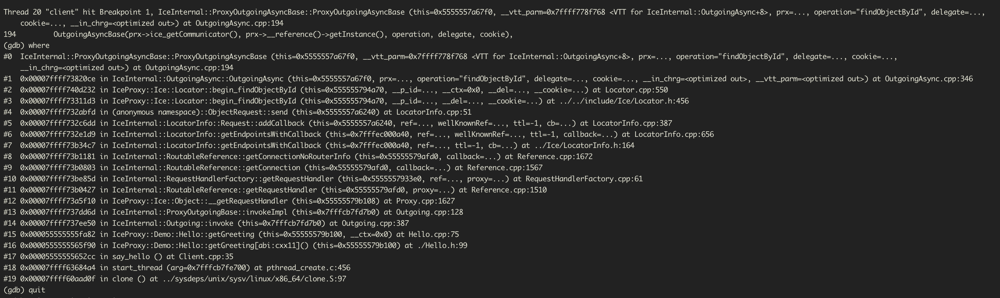

# 待解决问题如下

## 1. 偶尔同一时间出现大量 InvocationTimeoutException

### 问题描述：
   
在ice client 调用接口的时候出现了如下错误，在同一时间点大量出现，但是是偶现的, 请求量低的时段也可能出现

比较奇怪的是，在调用的时候是用的同步方式，只有第一行是的异常在Outgoing里边，其余的都出现在 OutgoingAsync 里边

```bash
2020-08-12 21:15:11 [xxxxx.cpp:284:Onxxxx]exception:Outgoing.cpp:194: Ice::InvocationTimeoutException:
2020-08-12 21:15:11 [xxxxx.cpp:284:Onxxxx]exception:OutgoingAsync.cpp:337: Ice::InvocationTimeoutException:
2020-08-12 21:15:11 [xxxxx.cpp:284:Onxxxx]exception:OutgoingAsync.cpp:337: Ice::InvocationTimeoutException:
2020-08-12 21:15:11 [xxxxx.cpp:284:Onxxxx]exception:OutgoingAsync.cpp:337: Ice::InvocationTimeoutException:
2020-08-12 21:15:11 [xxxxx.cpp:284:Onxxxx]exception:OutgoingAsync.cpp:337: Ice::InvocationTimeoutException:
2020-08-12 21:15:11 [xxxxx.cpp:284:Onxxxx]exception:OutgoingAsync.cpp:337: Ice::InvocationTimeoutException:
2020-08-12 21:15:11 [xxxxx.cpp:284:Onxxxx]exception:OutgoingAsync.cpp:337: Ice::InvocationTimeoutException:
2020-08-12 21:15:11 [xxxxx.cpp:284:Onxxxx]exception:OutgoingAsync.cpp:337: Ice::InvocationTimeoutException:
```


### 解决办法：
    
通过在ice client中 启动多个线程压测。其中server端在object 构造函数中sleep(10)，模拟程序延时启动的情况。然后在 IceInternal::ProxyOutgoingAsyncBase::ProxyOutgoingAsyncBase 处打断点。
可以得到如下调用栈




```c++
Thread 20 "client" hit Breakpoint 1, IceInternal::ProxyOutgoingAsyncBase::ProxyOutgoingAsyncBase (this=0x5555557a67f0, __vtt_parm=0x7ffff778f768 <VTT for IceInternal::OutgoingAsync+8>, prx=..., operation="findObjectById", delegate=...,
    cookie=..., __in_chrg=<optimized out>) at OutgoingAsync.cpp:194
194	    OutgoingAsyncBase(prx->ice_getCommunicator(), prx->__reference()->getInstance(), operation, delegate, cookie),
(gdb) where
#0  IceInternal::ProxyOutgoingAsyncBase::ProxyOutgoingAsyncBase (this=0x5555557a67f0, __vtt_parm=0x7ffff778f768 <VTT for IceInternal::OutgoingAsync+8>, prx=..., operation="findObjectById", delegate=..., cookie=...,
    __in_chrg=<optimized out>) at OutgoingAsync.cpp:194
#1  0x00007ffff73820ce in IceInternal::OutgoingAsync::OutgoingAsync (this=0x5555557a67f0, prx=..., operation="findObjectById", delegate=..., cookie=..., __in_chrg=<optimized out>, __vtt_parm=<optimized out>) at OutgoingAsync.cpp:346
#2  0x00007ffff740d232 in IceProxy::Ice::Locator::begin_findObjectById (this=0x555555794a70, __p_id=..., __ctx=0x0, __del=..., __cookie=...) at Locator.cpp:550
#3  0x00007ffff73311d3 in IceProxy::Ice::Locator::begin_findObjectById (this=0x555555794a70, __p_id=..., __del=..., __cookie=...) at ../../include/Ice/Locator.h:456
#4  0x00007ffff732abfd in (anonymous namespace)::ObjectRequest::send (this=0x5555557a6240) at LocatorInfo.cpp:51
#5  0x00007ffff732c6dd in IceInternal::LocatorInfo::Request::addCallback (this=0x5555557a6240, ref=..., wellKnownRef=..., ttl=-1, cb=...) at LocatorInfo.cpp:387
#6  0x00007ffff732e1d9 in IceInternal::LocatorInfo::getEndpointsWithCallback (this=0x7fffec000a40, ref=..., wellKnownRef=..., ttl=-1, callback=...) at LocatorInfo.cpp:656
#7  0x00007ffff73b34c7 in IceInternal::LocatorInfo::getEndpointsWithCallback (this=0x7fffec000a40, ref=..., ttl=-1, cb=...) at ../Ice/LocatorInfo.h:164
#8  0x00007ffff73b1181 in IceInternal::RoutableReference::getConnectionNoRouterInfo (this=0x55555579afd0, callback=...) at Reference.cpp:1672
#9  0x00007ffff73b0803 in IceInternal::RoutableReference::getConnection (this=0x55555579afd0, callback=...) at Reference.cpp:1567
#10 0x00007ffff73be85d in IceInternal::RequestHandlerFactory::getRequestHandler (this=0x5555557933e0, ref=..., proxy=...) at RequestHandlerFactory.cpp:61
#11 0x00007ffff73b0427 in IceInternal::RoutableReference::getRequestHandler (this=0x55555579afd0, proxy=...) at Reference.cpp:1510
#12 0x00007ffff73a5f10 in IceProxy::Ice::Object::__getRequestHandler (this=0x55555579b108) at Proxy.cpp:1627
#13 0x00007ffff737dd6d in IceInternal::ProxyOutgoingBase::invokeImpl (this=0x7fffcb7fd7b0) at Outgoing.cpp:128
#14 0x00007ffff737ee50 in IceInternal::Outgoing::invoke (this=0x7fffcb7fd7b0) at Outgoing.cpp:387
#15 0x000055555555fa82 in IceProxy::Demo::Hello::getGreeting (this=0x55555579b100, __ctx=0x0) at Hello.cpp:75
#16 0x0000555555565f90 in IceProxy::Demo::Hello::getGreeting[abi:cxx11]() (this=0x55555579b100) at ./Hello.h:99
#17 0x00005555555652cc in say_hello () at Client.cpp:35
#18 0x00007ffff63684a4 in start_thread (arg=0x7fffcb7fe700) at pthread_create.c:456
#19 0x00007ffff60aad0f in clone () at ../sysdeps/unix/sysv/linux/x86_64/clone.S:97
```
