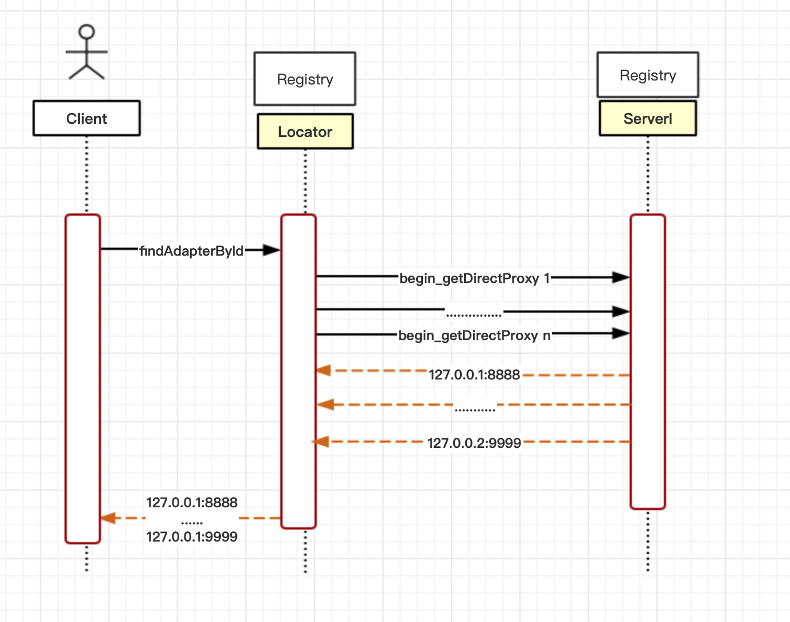
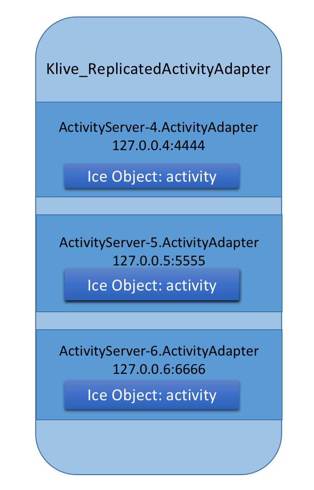

# ICE Registry端如何处理负载均衡，以及节点如何获取机器负载

在 Ice 这种 ```[ client -> registry -> {server1, server2} ]``` 模式的服务中, 负载均衡可以分成两部分

1. registry 端的负载均衡，即当 client 根据 ObjectId 获取对应的 server 时， registry 基于各个 server 的负载，决定返回哪些 server, 以及返回多少个

2. client 端的负载均衡，即 client 获取到所有可用的 server，然后根据自己的策略(随机 还是 顺序 还是 其他) 来决定调用哪个 server

这里我们只看 registry 在负载均衡中扮演的角色，以及 registry 是获取到各个 Node 负载的具体个交互过程

<br>

## 1. 找到分析的入手点

这个问题直接从代码里边找不太好找，但是 client 第一次发起调用时，会先请求 registry， 获取 server 的地址。那这个请求就是我们的入手点。用 strace 跟中 client 的执行轨迹，如下所示 (其中略去了不必要的内容，只留下了client 跟registey，server 的交互)

``` cpp
2452  connect(10, {sa_family=AF_INET, sin_port=htons(4061), sin_addr=inet_addr("10.0.133.14")}, 16) = -1 EINPROGRESS (Operation now in progress)
    ......
2458  recvfrom(10, "IceP\1\0\1\0\3\0\16\0\0\0", 14, 0, NULL, NULL) = 14
2458  epoll_ctl(7, EPOLL_CTL_DEL, 10, {0, {u32=43216648, u64=43216648}}) = 0
2458  epoll_ctl(7, EPOLL_CTL_ADD, 10, {EPOLLIN, {u32=43216648, u64=43216648}}) = 0
2458  getsockname(10, {sa_family=AF_INET, sin_port=htons(47022), sin_addr=inet_addr("10.0.132.6")}, [16]) = 0
2458  getpeername(10, {sa_family=AF_INET, sin_port=htons(4061), sin_addr=inet_addr("10.0.133.14")}, [16]) = 0
    ......
2458  sendto(10, "IceP\1\0\1\0\0\0T\0\0\0\1\0\0\0\7Locator\27ReplicationKLiveIceGrid\0\16findObjectById\1\0\20\0\0\0\1\1\10activity\0", 84, 0, NULL, 0) = 84
2458  epoll_wait(7, {{EPOLLIN, {u32=43216648, u64=43216648}}}, 256, -1) = 1
2458  recvfrom(10, "IceP\1\0\1\0\2\0K\0\0\0", 14, 0, NULL, NULL) = 14
2458  recvfrom(10, "\1\0\0\0\0008\0\0\0\1\1\10activity\0\0\0\0\1\0\1\1\0\37Klive_ReplicatedActivityAdapter", 61, 0, NULL, NULL) = 61
2458  sendto(10, "IceP\1\0\1\0\0\0k\0\0\0\2\0\0\0\7Locator\27ReplicationKLiveIceGrid\0\17findAdapterById\1\0&\0\0\0\1\1\37Klive_ReplicatedActivityAdapter", 107, 0, NULL, 0) = 107
2458  epoll_wait(7, {{EPOLLIN, {u32=43216648, u64=43216648}}}, 256, -1) = 1
2458  recvfrom(10, "IceP\1\0\1\0\2\0\177\0\0\0", 14, 0, NULL, NULL) = 14
2458  recvfrom(10, "\2\0\0\0\0l\0\0\0\1\1\5dummy\0\0\0\0\1\0\1\1\3\1\0\33\0\0\0\1\1\v10.0.133.15\2\232\0\0`\352\0\0\0\1\0\33\0\0\0\1\1\v10.0.133.16\234\216\0\0`\352\0\0\0\1\0\33\0\0\0\1\1\v10.0.133.14#\234\0\0`\352\0\0\0", 113, 0, NULL, NULL) = 113
    ......
2458  socket(PF_INET, SOCK_STREAM, IPPROTO_TCP) = 12
2458  setsockopt(12, SOL_TCP, TCP_NODELAY, [1], 4) = 0
2458  setsockopt(12, SOL_SOCKET, SO_KEEPALIVE, [1], 4) = 0
2458  fcntl(12, F_GETFL)                = 0x2 (flags O_RDWR)
2458  fcntl(12, F_SETFL, O_RDWR|O_NONBLOCK) = 0
2458  connect(12, {sa_family=AF_INET, sin_port=htons(39426), sin_addr=inet_addr("10.0.133.15")}, 16) = -1 EINPROGRESS (Operation now in progress)
    ......
2458  recvfrom(12, "IceP\1\0\1\0\3\0\16\0\0\0", 14, 0, NULL, NULL) = 14
    ......
2458  sendto(12, "IceP\1\0\1\0\0\0J\0\0\0\1\0\0\0\10activity\0\1\nfmct202107\7ice_isA\1\0\30\0\0\0\1\1\21::KLive::Activity", 74, 0, NULL, 0) = 74
2458  recvfrom(12,  <unfinished ...>
2458  <... recvfrom resumed> "IceP\1\0\1\0\2\0\32\0\0\0", 14, 0, NULL, NULL) = 14
2458  recvfrom(12, "\1\0\0\0\0\7\0\0\0\1\1\1", 12, 0, NULL, NULL) = 12
    ......
2452  sendto(12, "IceP\1\0\1\0\0\0`\0\0\0\2\0\0\0\10activity\0\1\nfmct202107\17GetActivityInfo\0\0&\0\0\0\1\1\323S\201\25\0\0\0\0H\254\t\0\0\0\0\0\323S\201\25\0\0\0\0\0\0\0\0\0\0\0\0", 96, 0, NULL, 0) = 96
    ......
2458  recvfrom(12, "IceP\1\0\1\0\2\0\207\1\0\0", 14, 0, NULL, NULL) = 14
2458  recvfrom(12, "\2\0\0\0\0t\1\0\0\1\1\377i\1\0\0\"evenesrank\":0,\"fmtopwarrior\":{\"rid\":631617,\"fid\":552427609,\"fname\":\"%E4%BB%93%E5%A4%AE%E5%98%89%E6%8E%AA%40\",\"fpic\":\"\",\"fonlinestatus\":0,\"tid\":516346130,\"tname\":\"%E8%8B%A5%E5%85%AE%E8%AF%B4%E5%A5%BD%E9%9A%BE%E5%95%8A\",\"tpic\":\"https%3A%2F%2Fkwimg9.kuwo.cn%2Fstar%2Fkuwolive%2F30%2F47%2F1626378225695_516346130.jpg\",\"sea\":8000,\"wid\":93,\"tm\":1627626682},\"_day_\":5", 377, 0, NULL, NULL) = 377
```

可以看到 client 执行 RPC 的流程：

1. client 同 registry 建立连接 (下边的两个方法都是调用的 Locator 对象)

   1.1. findObjectById 获取对象的 adapter，可以看到返回的是 adapter 的名称，所以还要进一步获取
   
   1.2. findAdapterById  根据 adapter 的名称获取具体的 adapter 实例，也就是 ip+port
        (可以看到 Ice Registry 返回了 10.0.133.15， 10.0.133.16， 10.0.133.14)

2. client 同 adapter 建立连接 (可以看到 client 新建立了一个 socket)

    2.1 ice_isA 是 checkedcast 方法的网络请求，用来判断有没有这个对象
    
    2.2 GetActivityInfo 是 具体的接口调用

根据上边的分析， registry 执行复杂均衡的地方应该在 Locator对象的 findAdapterById 这个方法

<br>

## 2. LocatorI 
----

沿着流程找我们会发现 LocatorI 负责 Ice 对象和查找逻辑。

LocatorI 是在 IceGridRegistry 服务启动时创建的对象，具体的位置在 ```src/IceGrid/RegistryI.cpp:551``` 。我们暂且不去管 locator 以何种方式存在于 RegistryI 中的，目前只需要知道，我们本篇所关心的负载均衡是在 Locator 中实现的就好

LocatorI 的接口文件在 slice/Ice/Locator.ice 中， 如其说明：

```
The Ice locator interface. This interface is used by clients to
lookup adapters and objects. It is also used by servers to get the
locator registry proxy.
```

LocatorI 的服务端实现使用了 AMD 方式，也就是所有请求异步处理的，所以请求的方法进来后，会走 xxxxxx_async() 方法，然后在方法中显示的调用返回。这里有个点需要注意的是：比如在 ``` LocatorI::findAdapterById_async() ``` 这个方法中，程序并没有显示的返回给客户端，看起来摸不着头脑。但是仔细分析的话，就能看到它在处理过程中创建了新的 Request 方法。根据我们的配置，对应的则是 ```ReplicaGroupRequest()```。程序返回数据到 Client 的逻辑就在这里。

<br>

## 3. client, registry, node 之前的交互过程
----

findAdapterById_async，返回的是 *direct proxy*, 所以，程序会异步的请求下 direct proxy， 这就是使用 AMD 的原因吧。因为这里比较绕，我们画一下这个流程:



<br>

## 4. 多个 adapter 是怎么来的
----

通过上图可以知道 LocatorI 可能会调用多次 getDirectProxy, 比如一个有多副本(replica) 的服务，它真实的 Adapter 可能有多个，比如：

* ActivityServer-4.ActivityAdapter
* ActivityServer-5.ActivityAdapter
* ActivityServer-6.ActivityAdapter

LocatorI 要分别获取如上各个 Adapter 的 DirectProxy。那些 adapters 是怎么来的呢。我们要在回去 ```LocatorI::findAdapterById_async``` 这个方法，重新分析我们之前忽略的逻辑 ```_database->getLocatorAdapterInfo```。

```_database->getLocatorAdapterInfo``` 这个方法就是获取所有具体 adapter 的名字， 然后根据负载均衡类型来对传出参数 adapters 排序。

这里边的逻辑还是有点复杂，但是最终存储 adapter 的类是这个 ```ReplicaGroupEntry（src/Ice/AdapterCache.h）```， 我们就可以看到它会根据_loadBalancing 的类型对当前所有的 adapter 进行不同的排序处理。


<br>

## 5. 怎么这么多不同类型的 Adapter
----

回到我们通过 strace 抓取的io请求过程：

1.  client 先是通过 ```findObjectById``` 获取到了 activity 这个对象对应的 adapter: Klive_ReplicatedActivityAdapter

2.  client 通过```findAdapterById``` 获取到了具体的 adapter 列表 [(IP+PORT), (IP+PORT), (IP+PORT)]

于是我们可能有下边的疑问:

1. findObjectById 我们是希望 find Object， 但是怎么返回的是一个 Adapter 名字 ？

2. 如果看它的源码就会发先，findAdapterById 的返回结果，对应代码里边的 DirectProxy。这是什么情况 ?

3. 我们在 findAdapterById 传入的是Adapter 名字，怎么返回那么多 DirectProxy ?

<br>

为了能理解这些问题，我们首先要对 ICE 中 Adapter replica 有比较清楚的理解。

其实对应多副本的对象中，都会有一个类似于 namespace 的 Adapter 名称，比如我们这里的 Klive_ReplicatedActivityAdapter。

这里的名称也就是 registry 和 client 交互用到的名称，client 只需要通过这个名称，就能得到所有正在运行的所有 adapter。

而像 ActivityServer-4.ActivityAdapter 这些是 registry 内部对每个 replica 的命名，为什么会有这些命名，因为一个具体的 adapter实例 是跟进程动态绑定的，当进程退出后，或重启后，端口或是IP就会发生变化。所以对于管理所有 adapter replicas 的 registry 来说需要对没有 adapter 实例命名

<br>



<br>

关于上边的我们的疑问：

1. findObjectById 我们是希望 find Object， 但是怎么返回的是一个 Adapter 名字 ？

    adapter 可以理解成是一个容器，它提供了对外的入口:ip+port, 所有的 object 都必须存在于一个容器中, 当我们查询某个对象时，需要返回这个入口，所以也就是 adapter， 因为我们用的 icegrid 的方式管理，所有的 adapter 都是 indirect 的（adapter 存在 replica 的可能），也就是有一个名字。所以此时就返回了这个名字

2. 如果看它的源码就会发先，findAdapterById 的返回结果，对应代码里边的 DirectProxy。这是什么情况 ?

    首先 Adapter 是对于 server 端而言的概念。它与 proxy 是一对儿， 当返回到 Client 来后，相当于我们拿到了这个 Adapter 的 proxy。
    需要注意的是，这里的 proxy 是 direct 类型的，因为我们需要直接连过去

3. 我们在 findAdapterById 传入的是Adapter 名字，怎么返回那么多 DirectProxy ?
   
    如上图所示，我们传入的算是一个命名空间，在 icegrid 的 replica 模式下，可能存在多个 adapter 实例(ip+port), 所以会返回多个