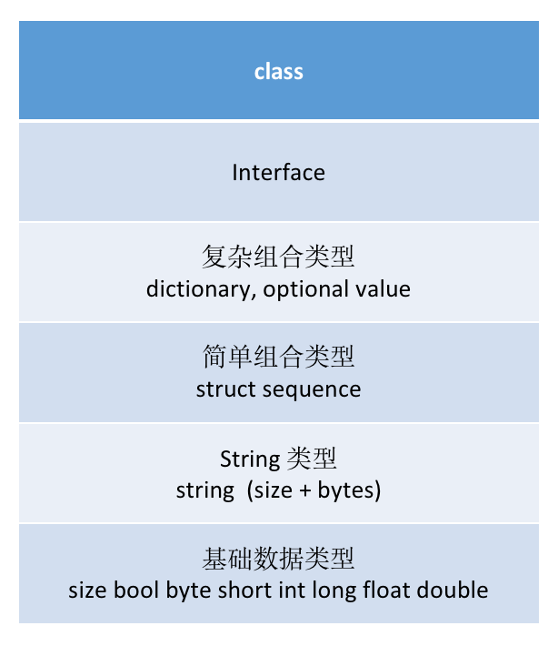
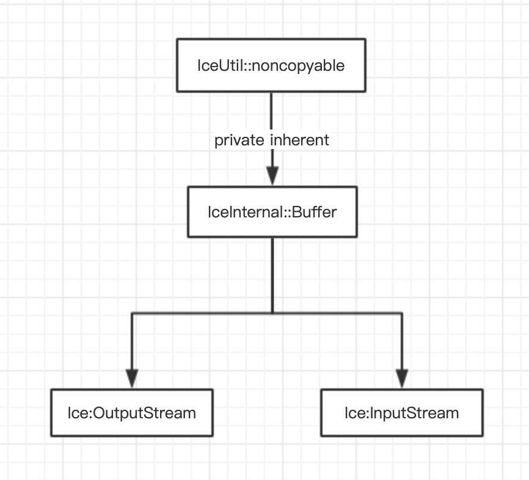

# Ice 的协议设计和数据的序列化

数据的传输协议也算是一种数据的存储格式，在保证可以高效解析的同时，还要兼顾存储空间的最小化，协议的设计会比较强的受使用场景和所传输数据本身的限制。

数据传输协议及其序列化是 RPC 的基石，这篇我们就探究一下 Ice 是如何设计实现的。

设计数据交互协议，一般要从两个方面着手：

1. 数据的 编码 和 序列化 算法。需要注意的是数据不能有歧义，也就是可以正确的反序列化

2. 交互规则，即 server 和 client 如何对动态的达成共识，比如确定协议版本等

<br>


## 1. 设计原则
----

本着高效和简洁的目标，Ice 在对数据序列化设计时，采用了如下的设计原则：

* 数值类型的用小端字节序
    
    市面上大多数机器都是小端机。但是大端机器，也不会有性能问题，因为无论是大端还是小端，数据最终还是要被 copy 一遍的。所以需要现在 copy 具体的的类型时，确定一下顺序就可以了，

* 没有对齐
    
    Ice 是二进制格式的协议，不使用数据对齐也就减少了空间的浪费。（题外话，对于固定格式的协议格式，协议层没有数据对齐的情况下，如果采用直接把数据块，强转成 struct 的时候，需要注意把数据对齐设置为1字节）

* 不采用 "receiver makes it right"
  
   这里不是说不校验，而是数据的所终使用者负责解析。中间可能有转发的节点，这些节点只负责数据拷贝转发，不会进行拆解重组。主要还是为了提高效率

<br>

关于字节序的处理，我们看下 Ice 在反序列化时，读取 int 类型时的实现:

（ Ice 中 定义 int 类型是 32bit 的数值，也就是4个字节 ）

 ```cpp
    void read(Int& v) // Inlined for performance reasons.
    {
        if(b.end() - i < static_cast<int>(sizeof(Int)))
        {
            throwUnmarshalOutOfBoundsException(__FILE__, __LINE__);
        }
        const Byte* src = &(*i);
        i += sizeof(Int);
#ifdef ICE_BIG_ENDIAN
        Byte* dest = reinterpret_cast<Byte*>(&v) + sizeof(Int) - 1;
        *dest-- = *src++;
        *dest-- = *src++;
        *dest-- = *src++;
        *dest = *src;
#else
        Byte* dest = reinterpret_cast<Byte*>(&v);
        *dest++ = *src++;
        *dest++ = *src++;
        *dest++ = *src++;
        *dest = *src;
#endif
    }
  ```

可以看到， 在读取 int 时，代码执行的复杂度是一样的，所以处理大小端时的效率也就没有差别了。

另外，如我们所说，Ice 中数据的使用端，在解析序列化的数据时，会判断数据的正确性，如上边函数一开始对是否越界的检查。


<br>

## 2. 几种数据类型的序列化和反序列化
----

我们挑几个典型的，或是有特别设计技巧的数据类型来分析下。

<br>

#### 2.1. size / count 的处理技巧
<br>

size 作为一个数值类型，第一个想法就是使用 int 或是 long 来表示，但是 Ice 对这个变量做了优化，以节省空间，还是很巧妙的:

* 小于 255 时: 用 1 个 byte 存储

* 大于等于 255 时: 用 1 个 byte 的255，跟上 4 byte的具体数值 (也就是 5 个字节)

也就是如果 size 较小时，会节省 3 个 byte 的空间。

反过来，如果大于等于 255 时，是不是就会浪费1个字节呢？ 现实中如果一个对象的size 到了255 个，我们假设用最小的char， 也就是 255 个byte， 此时我们数据的有效负载 是 255 / 260 ~ 98%, (多出来的 5个 byte 是 size 占用的)，数据的负载率还是很高的。

所以在反序列化时，第一个字节就至关重要了, 实现如下：

``` cpp
Int readSize() // Inlined for performance reasons.
{
    Byte byte;
    read(byte);
    unsigned char val = static_cast<unsigned char>(byte);
    if(val == 255)
    {
        Int v;
        read(v);
        if(v < 0)
        {
            throwUnmarshalOutOfBoundsException(__FILE__, __LINE__);
        }
        return v;
    }
    else
    {
        return static_cast<Int>(static_cast<unsigned char>(byte));
    }
}
```

想到的几个问题：

* 如果size 的个数超过了4个字节(65535) 怎么办 ？ 
    
    这个不用处理，首先至少 c++ 本身中 string 的 size 就是 32bit 的， 也就是不支持更大的 size 了， 多余的会被截断。而使用 c++ 实现的 Ice 也是不支持的。

* 这种 tricks 是怎么被想出来的？

    个人看来，基本思想就是对数据进行的区分，区分 热数据 和 冷数据。试图找到二者的区别，然后利用这些区别。像 python 中 小数缓存 一样，对于一些比较小的数， python专门做了常驻缓存，就是为了加快访问，算是有些许相同之处吧

<br>

<br>

#### 2.2. Strings, Sequence, Dictionary
<br>

* 都是 size + content 的结构

    这里的 Dictionary 里边的元素是很多个 pair，而 Ice 对 pair 的实现是一个 Struct， 注意 struct 里边只有数据本身，而没有 name， 因为我们不需要知道每个域叫什么，我们关心的是里边的数据，当然了数据的顺序要是固定的

* String 不是以 NULL 结束的


<br>

#### 2.3. Structure, Proxy
<br>

* 按照其声明的顺序依次排列
* 注意 structure 是不支持可选字段的
* Proxy 的实现也是用的structure，只不过不同类型的 endpoint (tcp/udp...) 其成员不同

<br>

#### 2.4. Class, Interface
<br>

* class 比 struct 复杂的地方在于，class 还需要额外的空间存储id, classtype_marker等信息

* Interface 在实现上相当于没有 data member 的 class

<br>

#### 2.5. Optional Value
<br>

* 可选参数需要有个**唯一**的tag来修饰，因为在编码实现中，可选参数传递的是tag而不是按顺序传递的
    
    可选参数更像是一个字典吧，所以我们在定义 tag 的时候要保证唯一

* 如果有可选参数和必须参数同时出现，必须参数一定是在前边，并且按顺序排列；可选参数在后边

* 可选参数是按这个tuple传递的 <type, tag, value>，且只有在value赋值的情况下，才会传value


自理解这些数据类型设计的时候，要知道复杂的数据类型是由基本数据类型堆彻起来的，在基本的数据类型上包含更多的信息。所以可以从网络协议栈的角度去理解，如下图
<br>



<br>
<br>

## 3.  数据封装和解析时相关的类
----

关于数据的 bulder 和 parser，主要在 Streaming Interface 里边, streaming interface 主要有两个子类：

* InputStream: 反序列化，字节流 到 slice type

* OutputStream: 序列化，slice type 到 字节流

对应的两个类 OutputStream 和 InputStream 均是继承自 IceInternal::Buffer。其功能是生成和解析字节流，(其实 就是一个 buffer builder) 

其继承关系如下：

<br>



<br>

注意一下这个 noncopyable 类, 把拷贝构造函数设置成了私有成员，就禁止了拷贝的行为


<br>
<br>

### 4 protocal message 格式
----

The Ice 使用的 message 类型有 5 种:
* Request (from client to server)
* Batch request (from client to server)
* Reply (from server to client)
* Validate connection (from server to client)
* Close connection (client to server or server to client)

<br>

#### 4.1  message 的消息组成
<br>

procotol message 包括 MessageHeader 和 MessageBody 两个部分

* Header 主要是标注 协议版本，编码版本, 消息类型等
    ``` cpp
    struct HeaderData
    {
        int  magic;
        byte protocolMajor;
        byte protocolMinor;
        byte encodingMajor;
        byte encodingMinor;
        byte messageType;
        byte compressionStatus;
        int  messageSize;           // 注意一下这里的 messageSize， 它指的是 size(header + body)
    }
    ```

* Body 根据不同 消息类型 有不同的结构, 以 Request 为例
    ``` cpp
    struct RequestData
    {
        int requestId;              // 请求的id
        Ice::Identity id;           // 对象ID， 也就是在 adapter 里边添加的那个 object 的id
        Ice::StringSeq facet;       // Ice Object 的版本号
        string operation;           // 方法名字
        byte mode;                  // normal 还是 idempotent
        Ice::Context context;       // 调用端的上下文变量
        Encapsulation params;       // operation 对应的参数
    }
    ```

注意这里的 param 是一个 Encapsulation 类型的变量:
``` cpp
struct Encapsulation
{
    int size;       // 也就是  size  = size( len(int) + len(byte) + len(byte) + len[data])
    byte major;
    byte minor;
    // [... size - 6 bytes ...]
}
```

这是一个特殊的struct，里边的 data 是一个字节流，如果要解析它，需要有对应的 .ice 文件才行，也就是只有最终接受和使用者才能解析。

<br>

<br>

### 5 数据的压缩 和 版本
----

协议数据的压缩用的是bzip2算法， 注意这里只压缩并message body， **不压缩** message header 部分。

压缩是在 带宽 和 CPU 中间做的取舍:

> 在我们决定是否要使用压缩时，需要考虑 带宽 和 CPU 中，哪个是我们的瓶颈。如果是因为我们服务的原因造成 带宽的占用率较高，甚至影响了服务的正常使用，那选择牺牲CPU而开启压缩，是很有价值的。否则，徒然增加了 cpu 的负荷，却没有带来任何收益。

<br> <br>

协议中引进版本号，主要是为了协议的改进和演化需要。