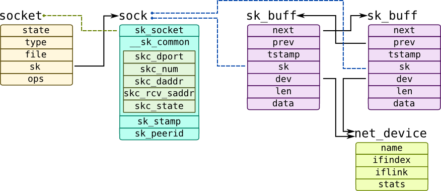
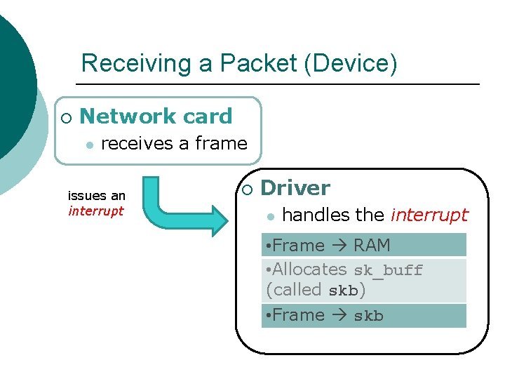
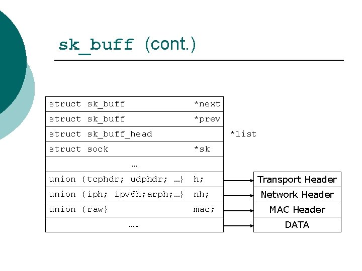
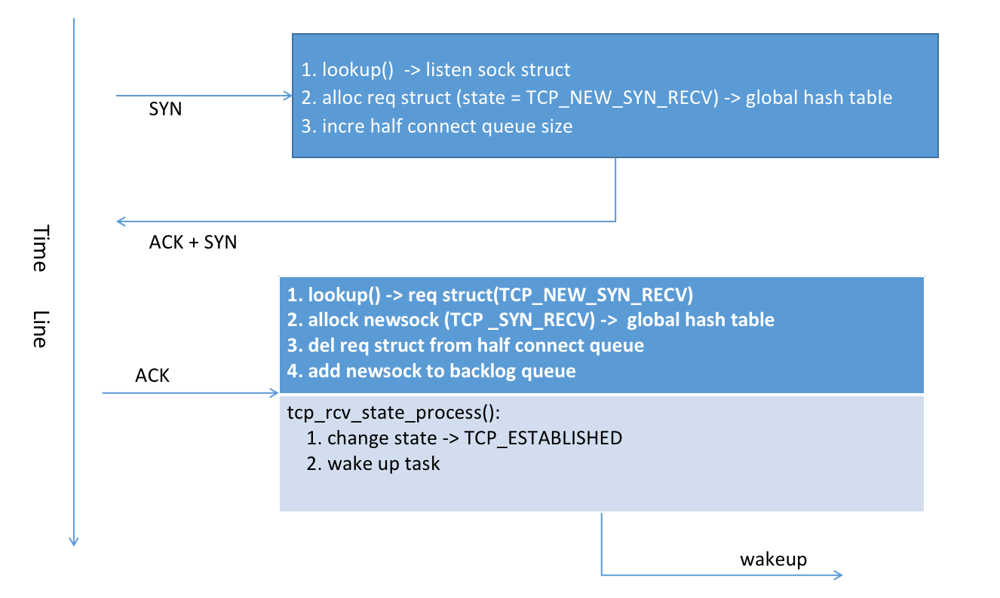

# TCP三次握手的实现

这篇我们看看内核中对于 TCP 三次握手的实现。握手的原理不多说了，我们主要着眼于具体的实现流程，包括相关的数据结构，如何维护状态的变迁等。

以 server 端的角度，来看三次握手，

<br>

## 1. 相关的数据结构
----
<br>

之前写过一篇关于 [socket 创建](https://gitee.com/oceanwave/opensource_code_analysis/blob/master/linux-4.19.180/socket%E7%9A%84%E5%88%9B%E5%BB%BA%E4%B8%8Elinux%E6%96%87%E4%BB%B6%E7%B3%BB%E7%BB%9F.md)相关的文章，主要是是从文件系统的角度看 socket。所以有些数据结构没有提到或是一扫而过。在 tcp 实际的实现中，有些核心的数据结构需要提前了解下：



<br>

- **struct socket**

    用户层通过调用 socket() 函数就会创建如下结构

    ``` cpp
    struct socket {
        // 注意这里的状态不是 TCP 变迁的状态，而是表示当前是否已经连接，是否正在连接
        socket_state		state;
        short			type;   // 通俗的说就是 TCP 还是 UDP ，还是其它
        unsigned long		flags;  // 阻塞非阻塞等
        struct socket_wq	*wq;    //  socket 本身也是事件源，所有监听 socket 事件发生的task 会放到这里
        struct file		*file;         // 作为一个特殊的文件，socket 会与一个 struct file关联，同时会分配对应的 fd
        struct sock		*sk;            // 这个是 网络数据存储的核心
        const struct proto_ops	*ops;   // 定义 socket 操作的接口集合，比如 bind, listen 等，不同的协议对应不同的实现。
    };
    ```

- **struct sock**

    这个接口太庞大了，包括接收缓冲区，监听队列(backlog), 发送缓冲区等等。总之，网络层的数据基本都在这里了。

- **struct sk_buff**
  
    这个是存储包的一个结构，驱动层收到一个网络包后，会创建这个结构并填充数据，如下:
    |收包流程|sk_buff结构|
    |-|-|
    |||
  
    
<br>

## 2. ```__inet_lookup_skb()``` 函数
----
<br>

分析源码要从内核中 tcp 层收到数据开始，也就是 TCP 处理逻辑的入口。

以 ipv4 为例，其入口是 ```tcp_v4_rcv(struct sk_buff *skb) (net/ipv4/tcp_ipv4.c1695)```

在开始之前，我们需要先看一下 ```tcp_v4_rcv``` 里边的 ```__inet_lookup_skb()``` 函数：

``` cpp
int tcp_v4_rcv(struct sk_buff *skb)
{
    // 以下两个分别保存了 TCP header  he IP header 
	th = (const struct tcphdr *)skb->data;
	iph = ip_hdr(skb);

    // 根据数据包查找对应的 struct sock 结构
	sk = __inet_lookup_skb(&tcp_hashinfo, skb, __tcp_hdrlen(th), th->source,
			       th->dest, sdif, &refcounted);
	if (!sk)
		goto no_tcp_socket;
}
```

这个函数的逻辑是： 根据 sk_buff (端口和地址) 获取对应的 ```struct sock``` 结构对象。因为 ```struct sock``` 里边存了当前连接的状态，TCP 的处理是一个状态机，当一个网络包过来的时候，就可以根据 ```struct sock``` 的状态进行处理了。

其查找流程；
    
1. 所有需要存储的 半连接 和 全连接状态都存储在一个全局的 hash table 里边 (```net/ipv4/tcp_ipv4.c:95```)

2. 当 server 收到 SYN 请求的时候，这时候内核会创建一个 request 结构，也会添加的这个 hash table 中

3. 根据 sk_buff 携带的信息( ip + port) 计算出 hash，在表里边找


<br>

## 3. 响应 client 的 SYN
----
<br>

由第一部分可以知道，第一步是根据数据包的信息来反向查找对应的 sock 结构，如果没有找到则说明包不需要处理，直接丢弃。

因为我们分析的是三次握手，server 端第一次收到的包必然是 SYN 包，此时还没有建立连接，所以 ```__inet_lookup_skb()``` 会返回处于 listen 状态的 ```struct sock```。

``` cpp
int tcp_v4_rcv(struct sk_buff *skb)
{
    // 查找 listen sock struct
	th = (const struct tcphdr *)skb->data;
	iph = ip_hdr(skb);
lookup:
	sk = __inet_lookup_skb(&tcp_hashinfo, skb, __tcp_hdrlen(th), th->source,
			       th->dest, sdif, &refcounted);
	if (!sk)
		goto no_tcp_socket;


    // 这个才是我们 listen 状态的 sock 要经过的逻辑
	if (sk->sk_state == TCP_LISTEN) {
		ret = tcp_v4_do_rcv(sk, skb);
		goto put_and_return;
	}

put_and_return:
	if (refcounted)
		sock_put(sk);

	return ret;
}
```

找到了入口，我们来看下响应 SYN 的调用栈：

``` cpp
// net/ipv4/tcp_ipv4.c:1695
tcp_v4_rcv()
    |
    |-> tcp_v4_do_rcv(sk, skb)
        |
        |-> tcp_checksum_complete(skb)
        |-> tcp_v4_cookie_check(skb)    // 预防 syn-flood 攻击
        |-> tcp_rcv_state_process(sk, skb)
            |
            |-> // 调用的是函数指针，icsk->icsk_af_ops->conn_request(sk, skb)，实际是如下这个函数
                tcp_conn_request()   // net/ipv4/tcp_input.c:6430
```

其中处理 syn 的主要逻辑在 ```tcp_conn_request()``` 函数里边。

``` cpp
int tcp_conn_request(struct request_sock_ops *rsk_ops,
		     const struct tcp_request_sock_ops *af_ops,
		     struct sock *sk, struct sk_buff *skb)
{
	struct tcp_fastopen_cookie foc = { .len = -1 };
	__u32 isn = TCP_SKB_CB(skb)->tcp_tw_isn;
	struct tcp_options_received tmp_opt;
	struct tcp_sock *tp = tcp_sk(sk);
	struct net *net = sock_net(sk);
	struct sock *fastopen_sk = NULL;
	struct request_sock *req;
	bool want_cookie = false;
	struct dst_entry *dst;
	struct flowi fl;

    // 如果 **半连接** 队列满了的话。可以使用 syncookies 机制继续响应 client 的请求
    // 而不是直接丢弃
	if ((net->ipv4.sysctl_tcp_syncookies == 2 ||
	     inet_csk_reqsk_queue_is_full(sk)) && !isn) {
		want_cookie = tcp_syn_flood_action(sk, skb, rsk_ops->slab_name);
		if (!want_cookie)
			goto drop;
	}

    // **全连接** 队列，这个也就是 listen 中 backlog 的值
	if (sk_acceptq_is_full(sk)) {
		NET_INC_STATS(sock_net(sk), LINUX_MIB_LISTENOVERFLOWS);
		goto drop;
	}

    // 创建一个新的 request
    // 这里有个要点： 新创建的 req， 的初始状态为 TCP_NEW_SYN_RECV
    //  并不是 TCP_SYN_RECV， 等下我们在看这里
	req = inet_reqsk_alloc(rsk_ops, sk, !want_cookie);
	if (!req)
		goto drop;

	if (fastopen_sk) {
	} else {
		tcp_rsk(req)->tfo_listener = false;

        // 把这个新的 requst放到全局 hash table 里边以供下次 ACK 包来的时候查找，
        //      注意req 的状态会设置成 TCP_NEW_SYN_RECV
        // 并且添加一个 SYN 超时定时器
		if (!want_cookie)
			inet_csk_reqsk_queue_hash_add(sk, req,
				tcp_timeout_init((struct sock *)req));
		
        // 给 client 返回 syn 和 ack
        af_ops->send_synack(sk, dst, &fl, req, &foc,
				    !want_cookie ? TCP_SYNACK_NORMAL :
						   TCP_SYNACK_COOKIE);
		
        // 如果使用了cookie 的话是不需要存储的，减轻了 syn-flood 攻击的影响
        if (want_cookie) {
			reqsk_free(req);
			return 0;
		}
	}
	reqsk_put(req);
	return 0;
}
```

总结一下：

当 server 端收到 sync 的时候，正常流程必然会发 syn + ack。除此之外，这里涉及到了两个队列：

1. 半连接队列

    这个其实就是代码中的存储 ```struct request_sock``` 的队列，保存着还没有收到 client ACK 的所有连接请求
    
    其获取方式是 ```reqsk_queue_len(&inet_csk(sk)->icsk_accept_queue)```

    需要注意的是，这个半半连接队列只保存了一个计数器，实际的 req 对象是保存在全局的 hash table 里边。所以检查半连接队列有没有满，直接检查计数器，而获取 req 对象，则是从 hash table 里边找。

    listener 里边的 icsk_accept_queue，会在 client 回复 ACK 后，短暂的加入下，并且里边是完整的 sock 信息而不是 req 结构。这样防止了在等待 ACK 的时候占用太多的资源。

2. 已连接(全连接)队列
   
    这个是已经连接建立好的队列

    其获取方式是 ```sk->sk_ack_backlog```

<br>

关于 TCP_NEW_SYN_RECV 状态 ([看这里](https://git.kernel.org/pub/scm/linux/kernel/git/stable/linux.git/commit/?id=10feb428a5045d5eb18a5d755fbb8f0cc9645626) 和 [这里](https://git.kernel.org/pub/scm/linux/kernel/git/stable/linux.git/log/?qt=grep&q=TCP_NEW_SYN_RECV))

当一个新的 SYN 请求过来的是否， kernel 会创建一个 req (```struct request_sock```), 来存放这个半连接的状态。需要看下这个结构创建的代码：

``` cpp
struct request_sock *inet_reqsk_alloc(const struct request_sock_ops *ops,
				      struct sock *sk_listener,
				      bool attach_listener)
{
	struct request_sock *req = reqsk_alloc(ops, sk_listener,
					       attach_listener);

	if (req) {
		struct inet_request_sock *ireq = inet_rsk(req);

		ireq->ireq_opt = NULL;

		atomic64_set(&ireq->ir_cookie, 0);
		ireq->ireq_state = TCP_NEW_SYN_RECV;        // 这个新创建的 request 的状态被置为 TCP_NEW_SYN_RECV
		write_pnet(&ireq->ireq_net, sock_net(sk_listener));
		ireq->ireq_family = sk_listener->sk_family;
	}

	return req;
}

static inline struct request_sock *
reqsk_alloc(const struct request_sock_ops *ops, struct sock *sk_listener,
	    bool attach_listener)
{
    // 注意下这个函数的传入参数 
    //      sk_listener 是监听 sock 结构
    //      attach_listener 传入的是 !wantcookie, 当不使用cookie的时候，也就是1
    // 这个函数的逻辑是
    //      1. 为 request_sock 分配空间
    //      2. 保存 sk_listener 到自己的成员里边，也就是让 request_sock 可以找到 创建它的 listener
    //          所以 listener 和 request_sock 就相当于 父子关系
	struct request_sock *req;

	req = kmem_cache_alloc(ops->slab, GFP_ATOMIC | __GFP_NOWARN);
	if (!req)
		return NULL;
	req->rsk_listener = NULL;
	if (attach_listener) {
		if (unlikely(!refcount_inc_not_zero(&sk_listener->sk_refcnt))) {
			kmem_cache_free(ops->slab, req);
			return NULL;
		}
		req->rsk_listener = sk_listener;
	}
	req->rsk_ops = ops;
	req_to_sk(req)->sk_prot = sk_listener->sk_prot;
	sk_node_init(&req_to_sk(req)->sk_node);
	sk_tx_queue_clear(req_to_sk(req));
	req->saved_syn = NULL;
	refcount_set(&req->rsk_refcnt, 0);

	return req;
}

```

<br>

## 4. 防范 SYN flood 攻击
----
<br>

在上述分析中，内核实现了 syncookie 机制，这是预防 [syn-flood 攻击](https://en.wikipedia.org/wiki/SYN_flood)的手段。

其基本思想，就是把 半连接状态(初始序列号) 的存储由 server 本地 转移到了 cookie 里边。这样再多的 syn 请求也不会持续占用 server 的存储空间了。玩法是这样的：

1. client 发送 SYN 给 server

2. server 根据 SYN 包中的一些列数据计算出一个唯一标识 cookie， 连同 syn-ack 一起返回给 client

3. client 回复 ACK 的时候要携带刚才的 cookie

4. server 解码 cookie 并校验，如果成功的话，分配资源保存当前连接


那问题来了：

1. sever 端如何知道 client 的 ISN (initial sequence number) 和 本端的 ISN ?
   
    首先本端的初始序列号就是 cookie 本身，也就是 client 回复 ACK 时的确认序列号就是 cookie + 1

    client 端的初始序列号也可以根据 ACK 对导出来， ACK 的序列号-1

2. 那 TCP 握手中的各种选项怎么存储的，比如窗口扩大选项，时间戳等？

    不支持。因为 cookie 本身的限制，这些状态没法存储。

<br>

在内核实现中根据是否使用 cookie，也分成两种逻辑；

1. 不使用 cookie
   
    这种情况就需要我们保存 client 的状态信息到 半连接队列里边，这个队列本身也是要占用资源的，这也就是 syn-flood 攻击的点

2. 使用 cookie
   
    可以理解成 cookie 本身携带了状态信心，也就是状态存到了 cookie 里边，而不是在 server 本地存储。因为不会持续占用 server 本地存储，所以也就化解了 syn-flood 攻击


<br>

## 5. 处理 client 的 ACK
----
<br>

接下来，就是等待 client 的 ACK 包了。我们又要回到 ```tcp_v4_rcv() (net/ipv4/tcp_ipv4.c:1695)``` 这个函数了。

这次我们通过``` __inet_lookup_skb() ``` 查找 sk 的时候，会在全局 hash_table 里边找到状态为 TCP_NEW_SYN_RECV 的那个 req 结构了;

``` cpp
int tcp_v4_rcv(struct sk_buff *skb)
{
	struct sock *sk;

    // 从全区的 hash table 里边找到之前创建的 req 对象
	sk = __inet_lookup_skb(&tcp_hashinfo, skb, __tcp_hdrlen(th), th->source,
			       th->dest, sdif, &refcounted);

    // 因为之前创建 req 对象的时候默认是 TCP_NEW_SYN_RECV ，所以正好走这个逻辑
	if (sk->sk_state == TCP_NEW_SYN_RECV) {
		struct request_sock *req = inet_reqsk(sk);
		bool req_stolen = false;
		struct sock *nsk;

        // 从 req 中或创建它的 listener 
		sk = req->rsk_listener;

		sock_hold(sk);
		refcounted = true;
		nsk = NULL;
		if (!tcp_filter(sk, skb)) {
			th = (const struct tcphdr *)skb->data;
			iph = ip_hdr(skb);
			tcp_v4_fill_cb(skb, iph, th);

            // 这个函数很短，但是干的事挺多，里边会创建一个完整的 sock 到 listener 的队列中
            // 这个新创建的 sock 结构的状态才是 TCP 协议中的 TCP_SYN_RECV 状态
			nsk = tcp_check_req(sk, skb, req, false, &req_stolen);
		}

		if (nsk == sk) {
			reqsk_put(req);
			tcp_v4_restore_cb(skb);

            // 接下来 tcp_child_process 处理所有的逻辑
		} else if (tcp_child_process(sk, nsk, skb)) {
			tcp_v4_send_reset(nsk, skb);
			goto discard_and_relse;
		} else {
			sock_put(sk);
			return 0;
		}
	}
}
```

1. lookup() -> req struct(TCP_NEW_SYN_RECV)
2. allock sock (TCP _SYN_RECV) ->  half connection queue

先梳理下这个逻辑的调用栈，然后在分析具体的函数；

``` cpp
tcp_v4_rcv()
    |
    |-> __inet_lookup_skb()
    |-> if (sk->sk_state == TCP_NEW_SYN_RECV)
        |
        |-> tcp_check_req(sk, skb, req, false, &req_stolen)
        |   |
        |   |-> child = inet_csk(sk)->icsk_af_ops->syn_recv_sock()
        |       |
        |       |-> newsk = tcp_create_openreq_child(sk, req, skb)  // 创建一个完成的 struct sock
        |       |   |
        |       |   |-> inet_csk_clone_lock()   // newsk 的状态设置为 TCP_SYN_RECV
        |       |
        |       |-> inet_ehash_nolisten()   // 把新创建的sock 添加到全局 hash table
        |
        |   |-> inet_csk_complete_hashdance()   // 从半连接队列中的删除，且把 newsk 放进全连接队列，注意newsk状态是TCP_SYN_RECV
        |
        |-> tcp_child_process(sk, nsk, skb)
            |
            |-> tcp_rcv_state_process(child, skb)
                |
                |-> case TCP_SYN_RECV:
                    |
                    |-> tcp_set_state(sk, TCP_ESTABLISHED);
                    |-> sk->sk_state_change(sk);    // 唤醒等待的 task
        
```

这里有个状态转换跟TCP 协议有点不一样

1. 当收到 SYN 的时候，是创建的一个 req struct, 此时的状态是 TCP_NEW_SYN_RECV
2. 当收到 ACK 的时候
    - 创建一个新的 sock struct，此时的状态是 TCP_SYN_RECV，并且放入全连接队列
    - 此时在调用 tcp_rcv_state_process 走的就是正常的 TCP 状态转换

大致如下图:




<br>

## 5. accept: 拿到建立好的连接
----
<br>

到此为止，内核已经把连接建立好了，实际上是有个一可用的 ```struct sock{}``` 在 listener 的 backlog 里边。接下来看看 accept 的实现，梳理下用户层的调用是如何跟 kernel 串联起来的。

accept 的实现在 ```net/socket.c:1627```， 其调用栈如下：

``` cpp
SYSCALL_DEFINE3(accept):
    |
    |-> __sys_accept4(fd, upeer_sockaddr, upeer_addrlen, 0)
        |
        |-> sockfd_lookup_light()   // 根据 fd 获取到 listener 的 socket 结构
        |-> sock_alloc()   // 分配一个新的 socket 结构，用来 wrap 新建立的连接(sock)
        |-> get_unused_fd_flags()   // 分配一个新的 fd, 也就是 accept 的返回值
        |-> sock_alloc_file()   // 用 new_socket 结构 创建一个新的 file 对象 (socket 也是一种文件系统)
        |-> sock->ops->accept()   // 调用 listener 的 accept, 这个是核心 
        |   |
        |   |-> inet_accept()  // net/ipv4/af_inet.c:729
        |       |
        |       |-> inet_csk_accept() // net/ipv4/inet_connection_sock.c
        |           |
        |           |-> reqsk_queue_remove()
        |
        |
        |-> fd_install()   // 关联 fd 和 file 对象。 至此，fd 就是一个有效的 socket 了
```

其实核心的逻辑就是在 listener 的 backlog 队列里边拿一个出来：

``` cpp

struct request_sock_queue *queue = &icsk->icsk_accept_queue;

static inline struct request_sock *reqsk_queue_remove(struct request_sock_queue *queue,
						      struct sock *parent)
{
	struct request_sock *req;

	spin_lock_bh(&queue->rskq_lock);
	req = queue->rskq_accept_head;
	if (req) {
		sk_acceptq_removed(parent); // 这个是把 backlog 的计数减一

        // 以下是链表操作，把都头节点指向原有头的 next
		WRITE_ONCE(queue->rskq_accept_head, req->dl_next);
		if (queue->rskq_accept_head == NULL)
			queue->rskq_accept_tail = NULL;
	}
	spin_unlock_bh(&queue->rskq_lock);
	return req;
}
```

逻辑是这样，这里主要是想看看 accept 从哪个队列中取(icsk_accept_queue)，以印证我们之前分析握手时对 backlog 的理解。

按照我们之前的分析，当 server 端收到 ACK 后， req 从半连接队列移除，同时把 newsock 加到 listener 的全连接队列(backlog)，是在如下这个函数```inet_csk_complete_hashdance```:

``` cpp
struct sock *inet_csk_complete_hashdance(struct sock *sk, struct sock *child,
					 struct request_sock *req, bool own_req)
{
	if (own_req) {
		inet_csk_reqsk_queue_drop(sk, req);
        
        // 这个从半连接队列中移除
		reqsk_queue_removed(&inet_csk(sk)->icsk_accept_queue, req);
		
        // 这个把 newsock 添加到 listener 的全连接队列(backlog)
        // 其中 sk 是 listener 的 sock 结构， 
        // child 是我们刚刚完成握手的 sock 结构
        if (inet_csk_reqsk_queue_add(sk, req, child))
			return child;
	}
	/* Too bad, another child took ownership of the request, undo. */
	bh_unlock_sock(child);
	sock_put(child);
	return NULL;
}

struct sock *inet_csk_reqsk_queue_add(struct sock *sk,
				      struct request_sock *req,
				      struct sock *child)
{
    // 这里是获取 listener 的 icsk_accept_queue， 跟 accept 获取的队列是同一个队列
	struct request_sock_queue *queue = &inet_csk(sk)->icsk_accept_queue;

	spin_lock(&queue->rskq_lock);
	if (unlikely(sk->sk_state != TCP_LISTEN)) {
		inet_child_forget(sk, req, child);
		child = NULL;
	} else {
		req->sk = child;
		req->dl_next = NULL;
		if (queue->rskq_accept_head == NULL)
			WRITE_ONCE(queue->rskq_accept_head, req);
		else
			queue->rskq_accept_tail->dl_next = req;
		queue->rskq_accept_tail = req;
		sk_acceptq_added(sk);
	}
	spin_unlock(&queue->rskq_lock);
	return child;
}
```

<br><br><br>

## 参考资料
----
<br>

* [Receiving TCP Data](https://www.halolinux.us/kernel-architecture/receiving-tcp-data.html)
* [Buffer Management](https://www.slideserve.com/tannar/buffer-management)
* [The Journey of a Packet Through the Linux](https://slidetodoc.com/the-journey-of-a-packet-through-the-linux/)
* [深入浅出TCP中的SYN-Cookies](https://segmentfault.com/a/1190000019292140)