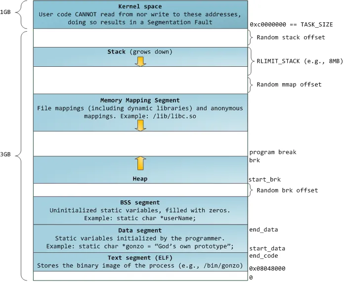

# malloc的内部实现


malloc 是 libc 的实现。包含两个部分：

* 一个是内核提供的内存分配接口

* 另一个是 malloc 内部为提升分配效率和资源利用率实现的一套缓存机制


<br>

## 1. 内存布局 layout
----
<br>

|  图一：layout  | 图二：layout with kernel  |
|  ----  | ----  |
|||

<br>

### 1.1. ASLR 机制
<br>

在内存布局中有 ```Random [mmap/brk] offset```，这个是 linux 针对缓存区溢出的安全保护机制([Address space layout randomization](https://en.wikipedia.org/wiki/Address_space_layout_randomization))。为了增加攻击者预测目的地址的难度。

其原理就是把内存布局中的 mmap，stack， heap 的起始地址随机化。我们通过两次运行同一个程序可以看到如下结果：
``` bash
cat /proc/PID/maps
```

``` s
liuyanan@localhost:~$ cat /proc/2784/maps
560652d96000-560652d97000 r--p 00000000 08:02 432923                     /home/liuyanan/lab/a.out
.............
560652d9a000-560652d9b000 rw-p 00003000 08:02 432923                     /home/liuyanan/lab/a.out
560652e09000-560652e2a000 rw-p 00000000 00:00 0                          [heap]
7f7efa403000-7f7efa404000 ---p 00000000 00:00 0 
7f7efa404000-7f7efac04000 rw-p 00000000 00:00 0 
.............
7f7efcc0d000-7f7efcc2f000 r--p 00000000 08:02 390826                     /usr/lib/x86_64-linux-gnu/libc-2.28.so
.............
7f7efcdc8000-7f7efcdca000 rw-p 001ba000 08:02 390826                     /usr/lib/x86_64-linux-gnu/libc-2.28.so
7f7efcdca000-7f7efcdce000 rw-p 00000000 00:00 0 
7f7efcdce000-7f7efcdd1000 r--p 00000000 08:02 390161                     /usr/lib/x86_64-linux-gnu/libgcc_s.so.1
.............
7f7efcde7000-7f7efcde8000 rw-p 00018000 08:02 390161                     /usr/lib/x86_64-linux-gnu/libgcc_s.so.1
7f7efcde8000-7f7efcdf5000 r--p 00000000 08:02 390829                     /usr/lib/x86_64-linux-gnu/libm-2.28.so
.............
7f7efcf6a000-7f7efcf6b000 rw-p 00181000 08:02 390829                     /usr/lib/x86_64-linux-gnu/libm-2.28.so
7f7efcf6b000-7f7efcff4000 r--p 00000000 08:02 393499                     /usr/lib/x86_64-linux-gnu/libstdc++.so.6.0.25
.............
7f7efd0e9000-7f7efd0eb000 rw-p 0017d000 08:02 393499                     /usr/lib/x86_64-linux-gnu/libstdc++.so.6.0.25
7f7efd0eb000-7f7efd0ef000 rw-p 00000000 00:00 0 
7f7efd0ef000-7f7efd0f5000 r--p 00000000 08:02 390844                     /usr/lib/x86_64-linux-gnu/libpthread-2.28.so
.............
7f7efd10b000-7f7efd10c000 rw-p 0001b000 08:02 390844                     /usr/lib/x86_64-linux-gnu/libpthread-2.28.so
7f7efd10c000-7f7efd112000 rw-p 00000000 00:00 0 
7f7efd127000-7f7efd128000 r--p 00000000 08:02 390163                     /usr/lib/x86_64-linux-gnu/ld-2.28.so
.............
7f7efd14f000-7f7efd150000 rw-p 00027000 08:02 390163                     /usr/lib/x86_64-linux-gnu/ld-2.28.so
7f7efd150000-7f7efd151000 rw-p 00000000 00:00 0 
7ffe6e57e000-7ffe6e59f000 rw-p 00000000 00:00 0                          [stack]
7ffe6e5c4000-7ffe6e5c7000 r--p 00000000 00:00 0                          [vvar]
7ffe6e5c7000-7ffe6e5c9000 r-xp 00000000 00:00 0                          [vdso]
```

``` s
liuyanan@localhost:~$ cat /proc/2802/maps
55e4fc952000-55e4fc953000 r--p 00000000 08:02 432923                     /home/liuyanan/lab/a.out
.............
55e4fc956000-55e4fc957000 rw-p 00003000 08:02 432923                     /home/liuyanan/lab/a.out
55e4fde1f000-55e4fde40000 rw-p 00000000 00:00 0                          [heap]
7f91686f6000-7f91686f7000 ---p 00000000 00:00 0 
.............
7f916a6fb000-7f916af00000 rw-p 00000000 00:00 0 
7f916af00000-7f916af22000 r--p 00000000 08:02 390826                     /usr/lib/x86_64-linux-gnu/libc-2.28.so
.............
7f916b0bb000-7f916b0bd000 rw-p 001ba000 08:02 390826                     /usr/lib/x86_64-linux-gnu/libc-2.28.so
7f916b0bd000-7f916b0c1000 rw-p 00000000 00:00 0 
7f916b0c1000-7f916b0c4000 r--p 00000000 08:02 390161                     /usr/lib/x86_64-linux-gnu/libgcc_s.so.1
.............
7f916b0da000-7f916b0db000 rw-p 00018000 08:02 390161                     /usr/lib/x86_64-linux-gnu/libgcc_s.so.1
7f916b0db000-7f916b0e8000 r--p 00000000 08:02 390829                     /usr/lib/x86_64-linux-gnu/libm-2.28.so
.............
7f916b25d000-7f916b25e000 rw-p 00181000 08:02 390829                     /usr/lib/x86_64-linux-gnu/libm-2.28.so
7f916b25e000-7f916b2e7000 r--p 00000000 08:02 393499                     /usr/lib/x86_64-linux-gnu/libstdc++.so.6.0.25
.............
7f916b3dc000-7f916b3de000 rw-p 0017d000 08:02 393499                     /usr/lib/x86_64-linux-gnu/libstdc++.so.6.0.25
7f916b3de000-7f916b3e2000 rw-p 00000000 00:00 0 
7f916b3e2000-7f916b3e8000 r--p 00000000 08:02 390844                     /usr/lib/x86_64-linux-gnu/libpthread-2.28.so
.............
7f916b3fe000-7f916b3ff000 rw-p 0001b000 08:02 390844                     /usr/lib/x86_64-linux-gnu/libpthread-2.28.so
7f916b3ff000-7f916b405000 rw-p 00000000 00:00 0 
7f916b41a000-7f916b41b000 r--p 00000000 08:02 390163                     /usr/lib/x86_64-linux-gnu/ld-2.28.so
.............
7f916b442000-7f916b443000 rw-p 00027000 08:02 390163                     /usr/lib/x86_64-linux-gnu/ld-2.28.so
7f916b443000-7f916b444000 rw-p 00000000 00:00 0 
7ffe4f304000-7ffe4f325000 rw-p 00000000 00:00 0                          [stack]
7ffe4f3e8000-7ffe4f3eb000 r--p 00000000 00:00 0                          [vvar]
7ffe4f3eb000-7ffe4f3ed000 r-xp 00000000 00:00 0                          [vdso]

```

上图中略去了重复的行，可以看到两次执行同一个程序，其 stack，heap 的起始地址都是不一样的。

其中关于 ASLR 的配置在 ```proc/sys/kernel/randomize_va_space``` 下 有以下三种情况:

(可以通过命令 ```sudo sysctl -w kernel.randomize_va_space=0``` 进行配置)

* 0 - 表示关闭进程地址空间随机化。

* 1 - 表示将mmap的基址，stack和vdso页面随机化。

* 2 - 表示在1的基础上增加栈（heap）的随机化。


<br>

### 1.2. VDSO 机制: Virtual Dynamic Shared Object
<br>

我们在内存布局中看到有 vdso 段。这个是为了减少系统调用带来的开销。其原理是：
> 内核把包含某.so的内存页在程序启动的时候映射入其内存空间，对应的程序就可以当普通的.so来使用里头的函数。
>
> The "vDSO" (virtual dynamic shared object) is a small shared library that the kernel automatically maps into the address space of all user-space applications.  Applications usually do not need to concern themselves with these details as the vDSO is most commonly called by the C library.  This way you can code in the normal way using standard functions and the C library will take care of using any functionality that is available via the vDSO.

注意这里存的都是只读的接口，我们通过 maps 的 权限 ```r-xp``` 也可以知道 ，可以执行并且只读。
这样对于尝试用的接口如 ```gettimeofday()``` 这样的函数，就可以不用走系统调用，而是直接在用户空间就可以完成。


<br>

## 2. 向内核申请内存的方法: ```brk() 和 mmap()```
----
<br>

首先先看下下这两种方法的定义和区别：

* brk()
  
    >brk()  and  sbrk() change the location of the program break, which defines the end of the process's data segment (i.e., the program break is the first location after the end of the uninitialized data segment).  Increasing the program break has the effect of allocating memory to the process; decreasing the break deallocates memory.

    >brk() sets the end of the data segment to the value specified by addr, when that value is reasonable, the system has enough memory, and the process does not exceed its maximum data size (see setrlimit(2)).

    >sbrk() increments the program's data space by increment bytes.  Calling sbrk() with an increment of 0 can be used to find the current location of the program break.

    可以看到 ```brk()`` 是在图 1 的 Heap 上分配空间，其原理就是通过把 heap 的顶向上移动来实现。
    
    我们所说的 heap，也就是 .bbs segment 的紧邻的后一个 segment，需要注意的是地址可能并不一定挨着(ASLR的原因)

    其实现在 ```mm/mmap.c:186```:
    ``` cpp
    SYSCALL_DEFINE1(brk, unsigned long, brk)
        |
        |-> down_write_killable(&mm->mmap_sem) // 加锁
        |-> // set min_brk， 根据是否设置了 ASLR 会有所不同
        |-> check_data_rlimit() // 检查 data segemnt 是否超过的系统设置 也就是 RLIMIT_DATA
        |-> find_vma(mm, oldbrk) // 检查 扩展后，是否跟 memory mapping segment 重叠了
        |-> mm->brk = brk;      // 设置 brk 的顶部地址
        |-> up_write();      // 释放锁
    ```

* mmap()
  
    >mmap() creates a new mapping in the virtual address space of the calling process.  The starting address for the new mapping is specified in addr.  The length argument specifies the length of the mapping.

    >If  addr  is  NULL, then the kernel chooses the address at which to create the mapping; this is the most portable method of creating a new mapping.  If addr is not NULL, then the kernel takes it as a hint about where to place the mapping; on Linux, the mapping will be created at a nearby page boundary.  The address of the new mapping is returned as the result of the call.

    >The contents of a file mapping (as opposed to an anonymous mapping; see MAP_ANONYMOUS below), are initialized using length bytes starting at offset offset in the file (or other object) referred to by the file  descriptor  fd.

    >MAP_ANONYMOUS: The mapping is not backed by any file; its contents are initialized to zero.  The fd and offset arguments are ignored; however, some implementations require fd to be -1 if MAP_ANONYMOUS (or MAP_ANON) is specified,  and portable applications should ensure this.  The use of MAP_ANONYMOUS in conjunction with MAP_SHARED is supported on Linux only since kernel 2.4.

    调用 mmap， 且指定了具体的 file 时，mmap 就相当于把 file 的内容映射大内存空间中。而如果使用 匿名 参数则仅仅是分配内存空间，并把数据置为0。这也就是我们在 图1 中的 ```Memory Mapping Segment``` 中分配内存的方法。

    其实现在 ```arch/x86/kernel/sys_x86_64.c:91```:
    ``` cpp
    SYSCALL_DEFINE6(mmap, unsigned long, addr, unsigned long, len,
		unsigned long, prot, unsigned long, flags,
		unsigned long, fd, unsigned long, off)
        |
        |-> ksys_mmap_pgoff(addr, len, prot, flags, fd, off >> PAGE_SHIFT)  // mm/mmap.c:1538
            |
            |-> vm_mmap_pgoff(file, addr, len, prot, flags, pgoff); // mm/util.c:344
                |
                |-> do_mmap_pgoff(file, addr, len, prot, flag, pgoff, &populate, &uf) // include/linux/mm.h:2321
                    |
                    |-> do_mmap(file, addr, len, prot, flags, 0, pgoff, populate, uf); // mm/mmap.c:1354
                        |
                        |-> mmap_region(file, addr, len, vm_flags, pgoff, uf);
    ```

    其中具体的分配流程就在 ```mmap_region()``` 函数里边


<br><br><br>


## 参考资料
----
<br>

* [malloc的底层实现](https://blog.csdn.net/z_ryan/article/details/79950737)
* [Understanding glibc malloc](https://sploitfun.wordpress.com/2015/02/10/understanding-glibc-malloc/comment-page-1/?blogsub=confirming#subscribe-blog%E3%80%82)
* [Glibc 内存管理](http://www.valleytalk.org/wp-content/uploads/2015/02/glibc%E5%86%85%E5%AD%98%E7%AE%A1%E7%90%86ptmalloc%E6%BA%90%E4%BB%A3%E7%A0%81%E5%88%86%E6%9E%901.pdf)
* [Syscalls used by malloc](https://sploitfun.wordpress.com/2015/02/11/syscalls-used-by-malloc/)
* [ASLR机制及绕过策略-栈相关漏洞libc基址泄露](https://www.jianshu.com/p/728f2ef139ae)