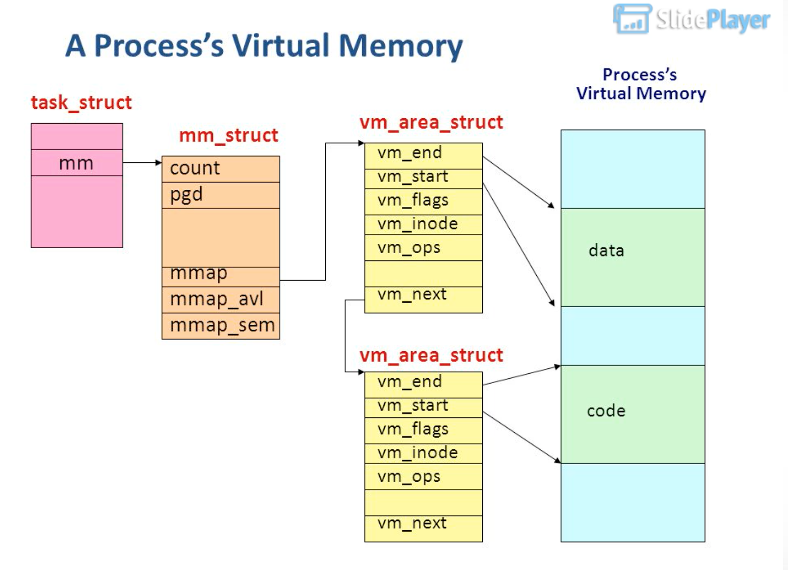
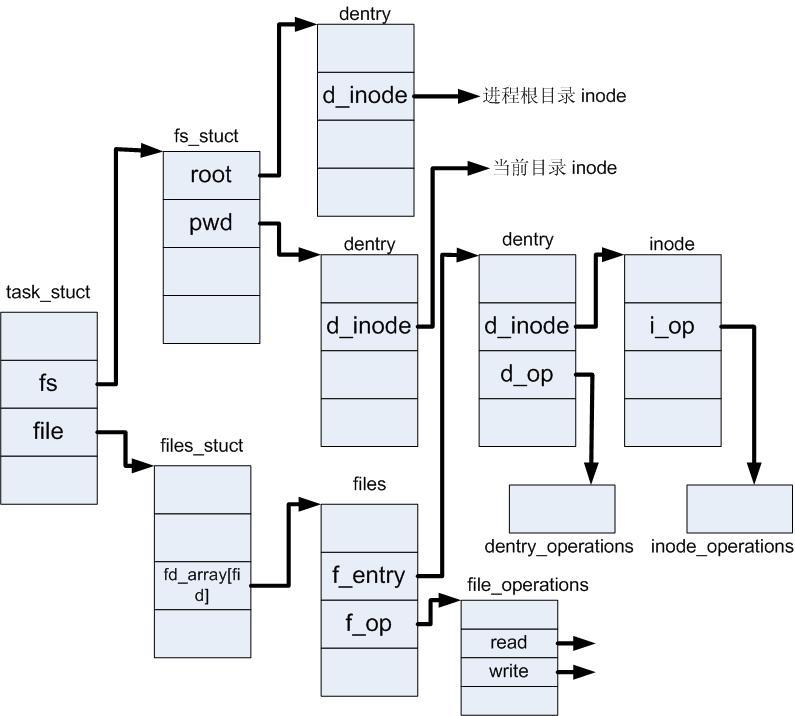

# pthread 创建了一个进程？

pthread 是 posix 规范下的一套 thread library。而 linux 内核中所有的任务都是在 task。我们看看 pthread 的内部实现是真的 thread 还是 process。

先看一下 POSIX 中 thread 的一些定义：

All threads within a process share the same address space.

Threads in the same process share:
- Process instructions
- Most data
- open files (descriptors)
- signals and signal handlers
- current working directory
- User and group id

Each thread has a unique:
- Thread ID
- set of registers, stack pointer
- stack for local variables, return addresses
- signal mask
- priority

我们从 pthread_create 入手。

<br>


## 1.  一个多线程的例子
----
<br>

我们通过[一个例子](https://gitee.com/oceanwave/linux_playground/blob/master/linux_api/multi_threads.cpp)，main函数创建5个线程，我们先看一下其进程树可以看到我们创建的进程在操作系统下，都是作为a.out 这个进程的子进程存在。

那 linux 下的线程就是进程吗？

``` s
liuyanan@localhost:~$ pstree -p 11243

bash(11243)───a.out(12748)─┬─{a.out}(12749)
                           ├─{a.out}(12750)
                           ├─{a.out}(12751)
                           ├─{a.out}(12752)
                           └─{a.out}(12753)
```

我们在看一下程序打印的日志：

``` s
liuyanan@localhost:~/lab$ ./a.out
main thread info: ppid=11243, pid=12748, tid=140214175258432
sub thread 4 info: ppid=11243, pid=12748, tid=140214141683456
sub thread 3 info: ppid=11243, pid=12748, tid=140214150076160
sub thread 2 info: ppid=11243, pid=12748, tid=140214158468864
sub thread 1 info: ppid=11243, pid=12748, tid=140214166861568
sub thread 0 info: ppid=11243, pid=12748, tid=140214175254272
```

需要注意的是，我们进程中获取的线程 pid 都是一样的，而 pstree 获取的线程 pid 是不一样的, 这是因为:

* 我们在程序中共获取的实际上是 Thread Group ID (TGID)， 当在主线程中 PID=TGID。

* 隶属于同一个线程组的 task, 其 TGDID 是相同的，所以非主线程调用 getpid() 时，得到的实际上是主线程的 PID


<br>

## 2. pthread_create 的内部逻辑
----
<br>

pthread_create 的实现在 glibc 下的 ```nptl/pthread_create.c``` (最初是 redhat 的 NPTL 项目)。

先看看其调用栈:

``` cpp
__pthread_create_2_1()
    |-> allocate_stack()
    |-> create_thread()
        |
        |-> __clone_internal()
        |   |
        |   | - // 核心在设置 clone 的各种 flag
        |   | - __clone(func)
        |
        |-> // scheduling parameters

```

最终调用的是 clone 函数，并且执行传出的函数。这个是系统调用，创建一个子进程。

一下是 clone 的 man 手册：

``` bash
NAME
       clone, __clone2 - create a child process

SYNOPSIS
       /* Prototype for the glibc wrapper function */

       #define _GNU_SOURCE
       #include <sched.h>

       int clone(int (*fn)(void *), void *child_stack,
                 int flags, void *arg, ...
                 /* pid_t *ptid, void *newtls, pid_t *ctid */ );

DESCRIPTION
       clone() creates a new process, in a manner similar to fork(2).

       Unlike fork(2), clone() allows the child process to share parts of its execution context with the calling process, such as the virtual address space, the table of file descriptors, and the table  of  signal  handlers.   (Note that on this manual page, "calling process" normally corresponds to "parent process".  But see the description of CLONE_PARENT below.)

       One use of clone() is to implement threads: multiple flows of control in a program that run concurrently in a shared address space.

       When  the  child process is created with clone(), it commences execution by calling the function pointed to by the argument fn.  (This differs from fork(2), where execution continues in the child from the point of the fork(2) call.)  The arg argument is passed as the argument of the function fn.

       When the fn(arg) function returns, the child process terminates.  The integer returned by fn is the exit status for the child process.  The child process may also terminate explicitly by calling exit(2) or after  receiving  a fatal signal.

       The child_stack argument specifies the location of the stack used by the child process.  Since the child and calling process may share memory, it is not possible for the child process to execute in the same stack as the call‐ing process.  The calling process must therefore set up memory space for the child stack and pass a pointer to this space to clone().  Stacks grow downward on all processors that run Linux (except the HP  PA  processors),  so child_stack usually points to the topmost address of the memory space set up for the child stack.
```

如 man 手册，glic 就是通过 clone 实现的的 thread。其核心就是在 clone() 的 flag 参数，我看看这些参数是如何实现共享地址空间等的机制的。


<br>

## 3. clone 一个 thread ?
----
<br>

clone 在内核中的实现跟 fork 是同一套逻辑，但是确可以区分子进程是否可以共享父进程的地址空间，这对于实现 thread 是很关键的。也是区别于一个子进程是一个 “我们眼中” 的 线程 还是 普通进程。要理解一个 thread 类型的 task 的创建，就要回到 glibc 中调用 clone 时，所传的 flag：

``` cpp
const int clone_flags = (CLONE_VM | CLONE_FS | CLONE_FILES | CLONE_SYSVSEM
			   | CLONE_SIGHAND | CLONE_THREAD
			   | CLONE_SETTLS | CLONE_PARENT_SETTID
			   | CLONE_CHILD_CLEARTID
			   | 0);
```

clone 的实现函数在 ```kernel/fork.c:2303```，其调用栈如下：

（我们只看跟clone相关的逻辑，像 CLONE_VFORK 等逻辑忽略）

``` cpp
SYSCALL_DEFINE5(clone)
    |
    |-> _do_fork()
        |
        |-> copy_process()
        |   |
        |   |-> dup_task_struct()
        |       |-> copy_fs()
        |       |-> copy_mm()
        |       |-> copy_files()    
        |       |-> copy_sighand()    
        |       |-> // 设置 子进程的group_leader 和tgid 。 i.e. CLONE_THREAD
        |       |-> ......
        |
        |
        |-> wake_up_new_task()

```


问题来了：

1. 子进程(新线程)是如何做到共享地址空间的 ?

    其核心操作是如下逻辑：
    ``` cpp

    // mm 是新创建的子进程的 mm_struct

    if (clone_flags & CLONE_VM) {
        mmget(oldmm);
        mm = oldmm;
        goto good_mm;
    }

    static inline void mmget(struct mm_struct *mm)
    {
        atomic_inc(&mm->mm_users);
    }
    ```
    
    也就是新的子进程共享父进程的 mm_struct。
    
    同时把 父进程的 mm_struct 对象的引用用户数加 1，表示当前又多了一个进程在使用这个 memory manager。
    
    这个 mm_struct 描述了一个进程的整个虚拟地址空间。如下图所示：
    
    

<br>

2. 子进程(新线程)是如何做到共享文件等资源的 ?

    实现在 ```kernel/fork.c1373``` copy_files() 函数，这个是把所有父进程打开的文件对象拷贝一份给子进程
    
    这里有个 file_struct 的关联图：

    
    
    
    TODO: 
        
        这里是生成一个新的 file_struct，假设子线程创建完成后，父线程又打开了新的文件该那，子线程怎么能知道呢？


<br>

3. 前文中，pstree 显示的 pid 跟 程序中通过 getpid() 获取的不一样?

    - 首先，内核本质上只有taks，没有区分进程还是线程，而是通过是否共享资源，是否有 leader 关系，在逻辑上完成了线程特性的实现。
   
        所以 pstree 中看到的是内核实际上的 uniq-taskid, 所以是不一样的。

    - 其次，程序中通过 getpid() 获取的是 gtid ，也就是主线程的pid, 在 ```kernel/sys.c:888``` 的实现：
  
      ``` cpp
      SYSCALL_DEFINE0(getpid)
        |
        |-> task_tgid_vnr()
      ```

<br>

4. 当我们 kill 一个 thread group 中的任何一个 task， 会怎样？

    那整个 group 都会关闭。为什么会这样？
    如我们[之前的分析](https://gitee.com/oceanwave/opensource_code_analysis/blob/master/linux-4.19.180/%E5%BD%93%E6%89%A7%E8%A1%8C%20kill%20-9%20pid%20%E6%97%B6%E6%93%8D%E4%BD%9C%E7%B3%BB%E7%BB%9F%E9%83%BD%E5%81%9A%E4%BA%86%E4%BB%80%E4%B9%88%EF%BC%9F.md) (```kernel/signal.c:981```), 如果发现是一个 thread group 会一并回收：

    ``` cpp
    static void complete_signal(int sig, struct task_struct *p, enum pid_type type)
    {
        ......

        /*
        * Found a killable thread.  If the signal will be fatal,
        * then start taking the whole group down immediately.
        */
        if (sig_fatal(p, sig) &&
            !(signal->flags & SIGNAL_GROUP_EXIT) &&
            !sigismember(&t->real_blocked, sig) &&
            (sig == SIGKILL || !p->ptrace)) {
            /*
            * This signal will be fatal to the whole group.
            */
            if (!sig_kernel_coredump(sig)) {
                /*
                * Start a group exit and wake everybody up.
                * This way we don't have other threads
                * running and doing things after a slower
                * thread has the fatal signal pending.
                */
                signal->flags = SIGNAL_GROUP_EXIT;
                signal->group_exit_code = sig;
                signal->group_stop_count = 0;
                t = p;
                do {
                    task_clear_jobctl_pending(t, JOBCTL_PENDING_MASK);
                    sigaddset(&t->pending.signal, SIGKILL);
                    signal_wake_up(t, 1);
                } while_each_thread(p, t);
                return;
            }
        }
        
        ......
    }
    ```

<br>

## 4. kernel 级的线程 ？
----
<br>

linux 也是有 kernel 级的线程的， 实现方法跟 pthread 是一样的。也是通过 ```_do_fork()``` 方法实现的 ```kernel/fork.c:2275```:

``` cpp
pid_t kernel_thread(int (*fn)(void *), void *arg, unsigned long flags)
{
	return _do_fork(flags|CLONE_VM|CLONE_UNTRACED, (unsigned long)fn,
		(unsigned long)arg, NULL, NULL, 0);
}
```

区别只在于 flags 选项不同，比如 CLONE_UNTRACED。


<br>

## 5. 总结
----
<br>

在内核中只有 task 这个物理实现，而线程或是进程只是在 task 之上的封装，进程/线程是逻辑区别

我们可以说 linux 实现了内核级的线程，虽然还是通过 clone 一个 task(历史上它就是进程)。但是 clone 的 这个 task 满足所有对线程的定义。

通过 pthread 创建的线程就会对应一个内核级的线程(task)。


<br><br><br>


## 参考资料
----

<br>

* [POSIX thread (pthread) libraries](https://www.cs.cmu.edu/afs/cs/academic/class/15492-f07/www/pthreads.html#BASICS)
* [Are Linux kernel threads really kernel processes](https://unix.stackexchange.com/questions/31595/are-linux-kernel-threads-really-kernel-processes)
* [进程—内存描述符（mm_struct）](https://blog.csdn.net/qq_26768741/article/details/54375524)
* [What is a Process ? A program in execution]()
* [fs_struct,file_struct,file,file_operations等的关联关系](https://blog.csdn.net/weixin_40710708/article/details/106373562)