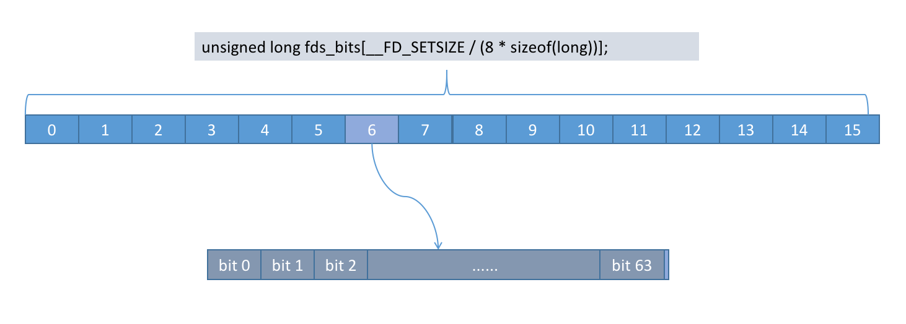

# select 的实现

源码版本： linux-4.19.180

<br>

## 1. select 的常规用法
----
<br>

select 的一般使用方法大致如下：

``` cpp
    fd_set read_fds_for_monitor;

    while(true) {

        // clear socket set
        FD_ZERO(&read_fds_for_monitor);

        // add listen socket to the set
        FD_SET(listen_fd, &read_fds_for_monitor);

        // copy all fds we interested into read_fds_for_monitor
        for(auto fd: client_fds)
            FD_SET(fd, &read_fds_for_monitor);
        }

        //wait for an activity on one of the sockets , timeout is NULL , so wait indefinitely
        int ret = select(max_fd+1, &read_fds_for_monitor, NULL, NULL, NULL);

        //If something happened on the master socket , then its an incoming connection
        if (FD_ISSET(listen_fd, &read_fds_for_monitor)) {

            int new_client_fd = accept(listen_fd, (struct sockaddr *)&address, (socklen_t*)&addrlen))<0);
            
            //add new socket to array of sockets
            client_fds[x] = new_client_fd;
        }

        //else its some IO operation on some other socket
        for (int i = 0; i < max_fd; i++) {
            if (FD_ISSET( client_fds[i], &read_fds_for_monitor)) {
                // it's reaable, so read data
                read( client_fds[i] , buf, 1024))
            }
        }
    }
```

<br>

## 2. 为什么会有 1024 的限制？
----
<br>

如上边的例子，应用程序需要监听的 fd， 都会存到 ```fd_set read_fds_for_monitor;``` 里边，传到 select 里边。这个 fd_set 的结构如下：

``` cpp
    typedef __kernel_fd_set		fd_set;

    #define __FD_SETSIZE	1024

    typedef struct {
        unsigned long fds_bits[__FD_SETSIZE / (8 * sizeof(long))];
    } __kernel_fd_set;

```

其中添加 fd 到 这个set 的操作如下：

``` cpp
    /* It's easier to assume 8-bit bytes than to get CHAR_BIT.  */
    #define __NFDBITS	(8 * (int) sizeof (__fd_mask))
    #define	__FD_ELT(d)	((d) / __NFDBITS)
    #define	__FD_MASK(d)	((__fd_mask) (1UL << ((d) % __NFDBITS)))

    #define __FD_SET(d, s) \
    ((void) (__FDS_BITS (s)[__FD_ELT(d)] |= __FD_MASK(d)))

    #define __FD_CLR(d, s) \
    ((void) (__FDS_BITS (s)[__FD_ELT(d)] &= ~__FD_MASK(d)))

    #define __FD_ISSET(d, s) \
    ((__FDS_BITS (s)[__FD_ELT (d)] & __FD_MASK (d)) != 0)
```

可以看到对 fd_set 的操作是一些列位操作, fd_set 的结构如下：




图中可以看到 fd_set 一共有 64 * 16 = 1024 bit，这个也就是 select 有 1024 限制的原因。

在 ```__FD_SET(d, s)``` 宏定义中， 设置 fd 的 操作分为两步：

1. 计算在哪个槽： ((d) / __NFDBITS) 等同于 fd / 32
   
    这里把 fds_bits 划分成了 32 个槽， 其中每个槽占 32 bit。比如 fd = 37，则其槽位号是 1。

2. 计算槽内的偏移：((__fd_mask) (1UL << ((d) % __NFDBITS)))， 等同于 fd % 32

3. 赋值： 或操作 |=


<br>

## 3. 内核中 select 的调用栈
----
<br>

select 系统调用的入口在 ```fs/select.c:697``` 。先看看其调用栈：

``` cpp
SYSCALL_DEFINE5(select, ...)
    |
    |-> kern_select()
        |
        | -> core_sys_select() 
        | -> poll_select_copy_remaining()
                |
                | -> do_select()
                        |
                        | -> loop { vfs_poll(); }
```

其核心在最后两个函数  ```do_select()``` 和 ```vfs_poll()```。

其中 do_select 的逻辑如下；

<br>

1. 设置 回调函数 __pollwait

    初始话 poll_table 这个变量

    __pollwait，这个函数的逻辑就是把当前进程添加到 设备的 等待队列 里边。
    
    这样当设备的状态改变的时候，就会通知唤醒当前进程。

    因为 do_select 是轮询的，轮询的条件是: 

    - 设置的超时时间到了。 

    - 底层设备唤醒了当前进程。

    ``` cpp
    /* Add a new entry */
    static void __pollwait(struct file *filp, wait_queue_head_t *wait_address,
                    poll_table *p)
    {
        struct poll_wqueues *pwq = container_of(p, struct poll_wqueues, pt);
        struct poll_table_entry *entry = poll_get_entry(pwq);
        if (!entry)
            return;
        entry->filp = get_file(filp);
        entry->wait_address = wait_address;
        entry->key = p->_key;

        // 这个是唤醒当前进程调用的方法
        init_waitqueue_func_entry(&entry->wait, pollwake);
        entry->wait.private = pwq;
        add_wait_queue(wait_address, &entry->wait);
    }
    ```

<br>

2. 循环调用所有文件的 poll() handler， 获取设备状态

    需要注意的是这里在获取设备状态的时候，同时会把我们刚才初始化的 poll_table 这个变量传给设备

    然后把当前进程添加到设备的等待列表

    等待列表是这样的：
    1. 当前进程在获取设备状态的时候，会把 poll_table_struct 传给设备（里边含有我们之前设置的回掉函数，即把当前进程添加到设备的等待队列）
    2. 设备当有状态改变的时候，从等待列表中取出所有对象，挨个通知。这也就是为什么每次 iteration 都要重新添加队列的原因

    ``` cpp
    static inline __poll_t vfs_poll(struct file *file, struct poll_table_struct *pt)
    {
        if (unlikely(!file->f_op->poll))
            return DEFAULT_POLLMASK;
        return file->f_op->poll(file, pt);
    }
    ```

<br>

3. 设备的 poll 函数是怎么实现的

    以 net/ipv4/af_inet.c tcp 的 poll 为例：


    ``` cpp

    // 驱动对文件接口方法的定义
    const struct proto_ops inet_stream_ops = {
        .release	   = inet_release,
        .bind		   = inet_bind,
        .connect	   = inet_stream_connect,
        .socketpair	   = sock_no_socketpair,
        .accept		   = inet_accept,
        .getname	   = inet_getname,
        .poll		   = tcp_poll,
        .ioctl		   = inet_ioctl,
        .listen		   = inet_listen,
        .shutdown	   = inet_shutdown,
        
        ......
    };
    ```
    
    其 poll 方法的实现在 net/ipv4/tcp.c:513：
    ``` cpp
    // 
    /*
    *	Wait for a TCP event.
    *
    *	Note that we don't need to lock the socket, as the upper poll layers
    *	take care of normal races (between the test and the event) and we don't
    *	go look at any of the socket buffers directly.
    */
    __poll_t tcp_poll(struct file *file, struct socket *sock, poll_table *wait)
    {
        __poll_t mask;
        
        ......

        // 把之前设置的 poll_table  添加到 socket 的等待队列
        sock_poll_wait(file, sock, wait);

        ......

        // 判断 socket 的可读可写状态，并设置相应的 mask
        if (state != TCP_SYN_SENT &&
            (state != TCP_SYN_RECV || tp->fastopen_rsk)) {
            int target = sock_rcvlowat(sk, 0, INT_MAX);

            if (tp->urg_seq == tp->copied_seq &&
                !sock_flag(sk, SOCK_URGINLINE) &&
                tp->urg_data)
                target++;

            if (tcp_stream_is_readable(tp, target, sk))
                mask |= EPOLLIN | EPOLLRDNORM;

            if (!(sk->sk_shutdown & SEND_SHUTDOWN)) {
                if (sk_stream_is_writeable(sk)) {
                    mask |= EPOLLOUT | EPOLLWRNORM;
                } else {  /* send SIGIO later */
                    sk_set_bit(SOCKWQ_ASYNC_NOSPACE, sk);
                    set_bit(SOCK_NOSPACE, &sk->sk_socket->flags);
                    smp_mb__after_atomic();
                    if (sk_stream_is_writeable(sk))
                        mask |= EPOLLOUT | EPOLLWRNORM;
                }
            } else
                mask |= EPOLLOUT | EPOLLWRNORM;

            if (tp->urg_data & TCP_URG_VALID)
                mask |= EPOLLPRI;
        } else if (state == TCP_SYN_SENT && inet_sk(sk)->defer_connect) {
            /* Active TCP fastopen socket with defer_connect
            * Return EPOLLOUT so application can call write()
            * in order for kernel to generate SYN+data
            */
            mask |= EPOLLOUT | EPOLLWRNORM;
        }

        ......

        return mask;
    }
    ```

    socket_poll_wait 方法的实现。
    ``` cpp    
    static inline void sock_poll_wait(struct file *filp, struct socket *sock,
                    poll_table *p)
    {
        if (!poll_does_not_wait(p)) {
            
            /// 这里就是调用的 我们之前设置回调函数，把 poll_table 添加到等待队列中
            poll_wait(filp, &sock->wq->wait, p);
            /* We need to be sure we are in sync with the
            * socket flags modification.
            *
            * This memory barrier is paired in the wq_has_sleeper.
            */
            smp_mb();
        }
    }
    ```

<br>

4. socket的如何唤醒进程？

    socket 唤醒进程就需要从 ```net/core/sock.c:2817``` 看起了。
    
    在这个函数中初始化了一系列方法，就包括 sk_state_change 方法, 也就是当socket 状态改变时，就会唤醒等待队列里边的进程

    ``` cpp
    void sock_init_data(struct socket *sock, struct sock *sk)
    {
        ......
        sk->sk_state_change	=	sock_def_wakeup;
        sk->sk_data_ready	=	sock_def_readable;
        sk->sk_write_space	=	sock_def_write_space;
        sk->sk_error_report	=	sock_def_error_report;
        sk->sk_destruct		=	sock_def_destruct;
        ......
    }
    ```

    其中 sock_def_readable 的调用栈如下；
    ``` cpp
    tcp_data_queue()
    |
    | -> tcp_data_ready()
            |
            | -> sk->sk_data_ready(sk) ( 即：sock_def_readable)
                    |
                    | -> wake_up_interruptible_sync_poll() 
                            |
                            | -> __wake_up_sync_key((x), TASK_INTERRUPTIBLE, 1, poll_to_key(m))
                                // 注意： 这个函数调用中 nr_exclusive 传的是1
                                    |
                                    | -> __wake_up_common_lock()
                                            |
                                            | -> __wake_up_common()
    ```

    最核心的就是 __wake_up_common 方法, 里边会遍历等待队列中所有的entry， 挨个唤醒。
    
    ``` __wake_up_common() ``` 函数如下：

    ``` cpp
    static int __wake_up_common(struct wait_queue_head *wq_head, unsigned int mode,
			int nr_exclusive, int wake_flags, void *key,
			wait_queue_entry_t *bookmark)
    {
        ......

        list_for_each_entry_safe_from(curr, next, &wq_head->head, entry) {
            unsigned flags = curr->flags;
            int ret;

            if (flags & WQ_FLAG_BOOKMARK)
                continue;

            // 注意这里的唤醒函数就是我们之前在 __pollwait 里边注册的
            ret = curr->func(curr, mode, wake_flags, key);
            
            ......
        }

        return nr_exclusive;
    }
    ```

    要理解这个 ```curr->func()`` 函数指针是怎么来的，我们要回到 __pollwait里边。
    __pollwait 这个是当我们轮询文件状态时，设置的回调。也就是说，底层驱动在返回设备状态时，执行我们这个回调。
    这个回调在把当前进程设置为 设备的 subscriber 时，还做了一件事： 就是设置了wakeup 回调，也就是具体唤醒的逻辑:

    ``` cpp
    /* Add a new entry */
    static void __pollwait(struct file *filp, wait_queue_head_t *wait_address,
                    poll_table *p)
    {
        struct poll_wqueues *pwq = container_of(p, struct poll_wqueues, pt);
        struct poll_table_entry *entry = poll_get_entry(pwq);
        if (!entry)
            return;
        entry->filp = get_file(filp);
        entry->wait_address = wait_address;
        entry->key = p->_key;
        init_waitqueue_func_entry(&entry->wait, pollwake);
        entry->wait.private = pwq;
        add_wait_queue(wait_address, &entry->wait);
    }

    static inline void
    init_waitqueue_func_entry(struct wait_queue_entry *wq_entry, wait_queue_func_t func)
    {
        wq_entry->flags		= 0;
        wq_entry->private	= NULL;
        wq_entry->func		= func; // 这里就是设置的回调函数 pollwake
    }

    // pollwake 最终调用的是 __pollwake:

    static int __pollwake(wait_queue_entry_t *wait, unsigned mode, int sync, void *key)
    {
        struct poll_wqueues *pwq = wait->private;
        DECLARE_WAITQUEUE(dummy_wait, pwq->polling_task);

        /*
        * Although this function is called under waitqueue lock, LOCK
        * doesn't imply write barrier and the users expect write
        * barrier semantics on wakeup functions.  The following
        * smp_wmb() is equivalent to smp_wmb() in try_to_wake_up()
        * and is paired with smp_store_mb() in poll_schedule_timeout.
        */
        smp_wmb();
        pwq->triggered = 1;

        /*
        * Perform the default wake up operation using a dummy
        * waitqueue.
        *
        * TODO: This is hacky but there currently is no interface to
        * pass in @sync.  @sync is scheduled to be removed and once
        * that happens, wake_up_process() can be used directly.
        */
        return default_wake_function(&dummy_wait, mode, sync, key);
    }
    ```

    这样，整个回调循环就走通了。

 <br>

 ## 5. 总结
----

<br>

1. 内核调用时的数据拷贝

    每次调用 select， 都会把所有 1024 个 fd 从用户空间 拷贝到 内核空间 (哪怕我们只设置了几个 fd)

    返回的时候，亦然。

<br>

2. pollwait 等待队列的作用？
   
   首先， 这个是 publisher / subscriber 模式下的一个数据结构。

   维护这个队列的是 publisher， 也就是在驱动层(socket，file等)， 因为底层的具体设备才是事件源。
   
   当设备中状态变化(可读，可写)时，会唤醒 pollwait 队列里边所有的 subscriber。

<br>

3. 为什么 do_select 中每次要遍历所有 fd ？

    分两种情况:
      
    * 3.1 首次进来的时候
        
        这时，我们要主动遍历下所有注册的fd，是否有我们关心的状态。
        
        同时在 poll_wait 里边，把我们作为 subscriber 添加到 fd 对应文件的等待队列中，因为我们不能再这里无限的轮询。

        当第一轮遍历完成的时候，如果没有我们关系的时间，此时我们进入睡眠状态，让出 cpu。

    * 3.2 当被唤醒的时候

        当我们关心的 fd 有事件发生时， 就是唤醒当前进程。问题来了，我们被唤醒了，但是不知道到底有 哪些文件的 哪些状态改变了。

        所以我们要再一次遍历我们注册的所有 fd，挨个检查是否有我们关系的事件。

        同理，当没有我们关心的事件时，会再一次让出cpu。反之，会把对应的fd设置好相应的事件，并返回用户空间。

<br>

<br><br><br>

## 参考文档

* [tcp协议栈处理各种事件的分析] (https://www.iteye.com/blog/simohayha-559506)

* [poll 源码概述](https://github.com/Liu-YT/IO-Multiplexing/blob/master/%E6%BA%90%E7%A0%81%E5%89%96%E6%9E%90/poll.md)

* [Linux system call: source code analysis of select() system call](https://www.fatalerrors.org/a/linux-system-call-source-code-analysis-of-select-system-call.html)

* [Linux select 一网打尽](https://www.codenong.com/jsa063a3a6e654/)