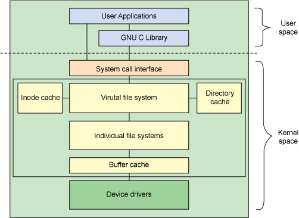
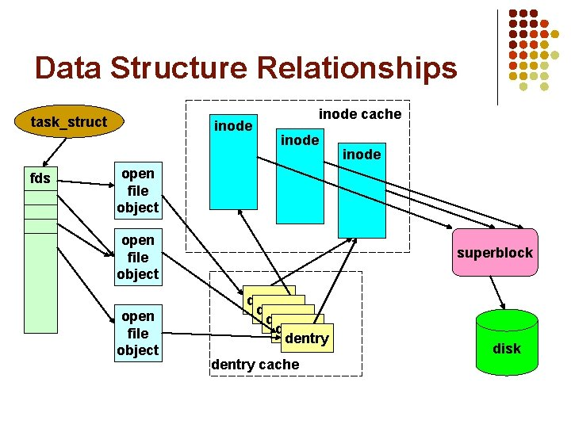

# socket的创建与linux文件系统

在 linux 中所有有数据存在的都可以看成是一个 file。而 linux 的 vfs 提供了统一的接口对文件数据进行访问。那 linux 是怎么把不同的 “数据存在” 搞成文件的。比如一个 tcp 连接支持 read，write 操作，就是典型的一个文件。

linux 中有几个虚拟文件系统，比如 DebugFS, SecurityFS, PipeFS, and SockFS。这些以 fs 的形式出现，提供不同的服务。

其中 sockfs 是内存中的一个 pseudo-filesystem。也就是当我们在一个 socket 上执行 read/write 时，其实就是在访问 sockfs。而此时这个sockfs 就是介于 系统调用(syscall) 和 具体设备(socket) 的一个文件系统。

我们以 socket 为例，看看它是如何跟一个 文件系统 关联到一起的。

<br>


## 1. linux 文件系统概览
----
<br>

linux 中实现了 vfs 的抽象层。具体的设备通过挂载的方式，添加到 file system tree 上边。然后就可以通过统一的接口对其进行访问。linux 文件系统的实现结构如下图所示：



<br>

在具体的实现上，有一些关键的数据结构，需要提前知道一下：

* **superblock** (```include/linux/fs.h:1370```): 
  
    存储的是文件系统的元信息，也就是当前这个文件系统的所有信息。包括多有的inode， 文件系统类型等

    <br>

* **inode** (```include/linux/fs.h:593```): 

    存储的是文件的原信息，inode包含很多的文件元信息，例如：字节数、属主UserID、属组GroupID、读写执行权限、时间戳等。 但不包含文件名，
    文件名存放在目录当中
    
    系统打开文件的步骤为：
    
    1. 通过文件名找到 inode 的号码
    2. 通过 inode号码 获取对应的 inode 信息，也就是inode 指针
    3. 根据 inode信息， 找到对应的 block ，然后读出数据

    <br>

* **dentry** (```linux/include/dcache.h:88```):
  
    即 directory entry。 简言之，它表示该目录下的文件或是子目录。

    <br>

* **file object** (```include/linux/fs.h:1370```):

    一个被打开的文件

    <br>

<br>

以上几个结构的关系如下图：





<br>


## 2. sockfs 的初始化
----
<br>

内核在启动的时候，会初始化 网络子系统，然后通过调用 sock_init 初始化 sockfs，其调用栈如下(```net/socket.c```)：

```cpp
sock_init()
    |
    |-> ...
    |-> register_filesystem()
    |-> kern_mount(&sock_fs_type)
        |-> kern_mount_data()
            |-> vfs_kern_mount()
```

这里重点是 sock_fs_type 和 fs_ops 函数；

``` cpp
static struct file_system_type sock_fs_type = {
	.name =		"sockfs",
	.mount =	sockfs_mount,
	.kill_sb =	kill_anon_super,
};
```

其中在 mount sockfs 的时候重定义了一组 fs_ops
``` cpp
static struct dentry *sockfs_mount(struct file_system_type *fs_type,
			 int flags, const char *dev_name, void *data)
{
	return mount_pseudo_xattr(fs_type, "socket:", &sockfs_ops,
				  sockfs_xattr_handlers,
				  &sockfs_dentry_operations, SOCKFS_MAGIC);
}

static const struct super_operations sockfs_ops = {
	.alloc_inode	= sock_alloc_inode,
	.destroy_inode	= sock_destroy_inode,
	.statfs		= simple_statfs,
};
```

我们看看这个 inode 的分配函数:
``` cpp
static struct inode *sock_alloc_inode(struct super_block *sb)
{
	struct socket_alloc *ei;
	struct socket_wq *wq;

	ei = kmem_cache_alloc(sock_inode_cachep, GFP_KERNEL);
	if (!ei)
		return NULL;
	wq = kmalloc(sizeof(*wq), GFP_KERNEL);
	if (!wq) {
		kmem_cache_free(sock_inode_cachep, ei);
		return NULL;
	}

    // 注意这里等待队列，也就是那些等待socket 事件发生的 task 会被放到这里
    // 这也使得我们可以异步的等待事件通知
	init_waitqueue_head(&wq->wait);
	wq->fasync_list = NULL;
	wq->flags = 0;
	ei->socket.wq = wq;

    // socket 开始未连接到其他socket
	ei->socket.state = SS_UNCONNECTED;
	ei->socket.flags = 0;
	ei->socket.ops = NULL;
	ei->socket.sk = NULL;
	ei->socket.file = NULL;

	return &ei->vfs_inode;
}
```

另外 sockfs 的 dentry_operations(```net/socket.c:309```) 也

文件系统加载好了，然后我们开始看如何在sockfs 中创建新 "文件"。

<br>

## 3. 一个 socket 的创建
----
<br>

socket 的创建是通过系统调用 ```int socket(int domain, int type, int protocol)``` 完成的。其在内核中的调用栈如下(```net/socket.c:1353```)：

``` cpp
SYSCALL_DEFINE3(socket, int, family, int, type, int, protocol)
    |
    |-> __sys_socket()
        |
        |-> sock_create()
        |   |
        |   |-> __sock_create()
        |        |
        |        |->sock_alloc()
        |            |
        |            |-> new_inode_pseudo()
        |               |
        |               |-> alloc_inode()
        |                   |
        |                   |-> sb->s_op->alloc_inode()  //  这里实际上也就是 sock_alloc_inode
        |    
        |    
        |-> sock_map_fd()
            |
            |-> get_unused_fd_flags()
            |-> sock_alloc_file()
            |-> fd_install()
```


这里主要完成了两个操作，一个是创建inode， 另一个是 install fd。
install fd ，也就是把 fd，file，inode 3 者关联起来。

所以当我们创建一个 socket 的时候，实际上是在 sockfs 中创建一个 file 和与之对应的 inode。

其挂载点是在 sock_mnt。

我们看一下在 sockfs 中创建 file object 的具体实现：
``` cpp
struct file *sock_alloc_file(struct socket *sock, int flags, const char *dname)
{
	struct file *file;

	if (!dname)
		dname = sock->sk ? sock->sk->sk_prot_creator->name : "";

    // 其实重点是传过去的一组 file ops 方法
    // 这些方法决定了这个file 的行为
	file = alloc_file_pseudo(SOCK_INODE(sock), sock_mnt, dname,
				O_RDWR | (flags & O_NONBLOCK),
				&socket_file_ops);
	if (IS_ERR(file)) {
		sock_release(sock);
		return file;
	}

	sock->file = file;
	file->private_data = sock;
	return file;
}
```

socket 上比较特殊的文件操作如下：

``` cpp
/*
 *	Socket files have a set of 'special' operations as well as the generic file ones. These don't appear
 *	in the operation structures but are done directly via the socketcall() multiplexor.
 */
static const struct file_operations socket_file_ops = {
	.owner =	THIS_MODULE,
	.llseek =	no_llseek,
	.read_iter =	sock_read_iter,
	.write_iter =	sock_write_iter,
	.poll =		sock_poll,              // 查询 socket 上的状态
	.unlocked_ioctl = sock_ioctl,
#ifdef CONFIG_COMPAT
	.compat_ioctl = compat_sock_ioctl,
#endif
	.mmap =		sock_mmap,
	.release =	sock_close,
	.fasync =	sock_fasync,
	.sendpage =	sock_sendpage,
	.splice_write = generic_splice_sendpage,
	.splice_read =	sock_splice_read,
};
```


总结一下socket 的创建：

1. 创建 inode 结构
   
   socket 重写的 inode 的分配和初始化，因为需要初始化一些特定的状态，比如初始连接状态
   同时也会初始化等待队列，这个使得它可以像其他设备一样，异步通知 subscriber

2. 创建 file 对象
   
   其中的重点是关联的一些 文件操作方法。这些是 vsf 接口方法，具体的实现有些也是在 ```struct socket (include/linux/net.h:110)``` 结构中(```proto_ops```), 但是根据socket 的协议类型不同，具体操作方法也不同。下一小节会提到这个

    

<br>

## 4.  "文件"的操作
----
<br>


当我们创建好 socket 文件后，就可以通过函数操作这个文件了。这里我们理顺下，一个普通的文件读操作是如何在socket 上实现的。从上边知道，file object 创建时，重写了读方法 ```sock_read_iter()```,  其调用栈如下：

``` cpp
sock_read_iter()
    |
    |-> sock_recvmsg()
        |
        |-> sock_recvmsg_nosec()
            |
            |-> sock->ops->recvmsg()
```

可以看到最中都落到了 socket 上的 ops。因为根据 socket 的协议不同(tcp, udp, 域套接字)，所以 ```sock-ops-recvmsg()``` 的具体实现也就不同， 我们以 tcp (```net/ipv4/af_net.c:980```)为例：
   
   ``` cpp
   const struct proto_ops inet_stream_ops = {
        .family		   = PF_INET,
        .owner		   = THIS_MODULE,
        .release	   = inet_release,
        .bind		   = inet_bind,
        .connect	   = inet_stream_connect,
        .socketpair	   = sock_no_socketpair,
        .accept		   = inet_accept,
        .getname	   = inet_getname,
        .poll		   = tcp_poll,
        .ioctl		   = inet_ioctl,
        .listen		   = inet_listen,
        .shutdown	   = inet_shutdown,
        .setsockopt	   = sock_common_setsockopt,
        .getsockopt	   = sock_common_getsockopt,
        .sendmsg	   = inet_sendmsg,
        .recvmsg	   = inet_recvmsg,
    #ifdef CONFIG_MMU
        .mmap		   = tcp_mmap,
    #endif
        .sendpage	   = inet_sendpage,
        .splice_read	   = tcp_splice_read,
        .read_sock	   = tcp_read_sock,
        .sendmsg_locked    = tcp_sendmsg_locked,
        .sendpage_locked   = tcp_sendpage_locked,
        .peek_len	   = tcp_peek_len,
    #ifdef CONFIG_COMPAT
        .compat_setsockopt = compat_sock_common_setsockopt,
        .compat_getsockopt = compat_sock_common_getsockopt,
        .compat_ioctl	   = inet_compat_ioctl,
    #endif
        .set_rcvlowat	   = tcp_set_rcvlowat,
    };
   ```

可以看到 tcp 类型的socket 的读操作，其实是落到了 ```inet_recvmsg() (net/ipv4/af_inet.c:820)``` 这个方法上边：

``` cpp
inet_recvmsg()
    |
    |-> tcp_recvmsg() // net/ipv4/tcp.c:1940
```


<br>

如上，sockfs 和 linux 文件系统的关系，以及socket 的操作大致就是这样


<br><br><br>

## 参考资料
----

* [Overview of the Linux Virtual File System](https://www.kernel.org/doc/html/latest/filesystems/vfs.html)
* [Linux inode 详解](https://www.cnblogs.com/llife/p/11470668.html)
* [LINUX SOCKFS文件系统分析](https://blog.csdn.net/lickylin/article/details/102540200)
* [The relationship between Linux socket and file system](https://titanwolf.org/Network/Articles/Article?AID=d99fa66f-7cac-456a-8633-9fa98d4a0ccc#gsc.tab=0)