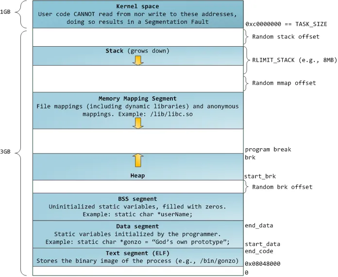

# malloc的内部实现


概述概述概述概述概述概述

<br>

## 1. 内存布局 layout
----
<br>

|  图一：layout  | 图二：layout with kernel  |
|  ----  | ----  |
|||

<br>

### 1.1. ASLR 机制
<br>

在内存布局中有 ```Random [mmap/brk] offset```，这个是 linux 针对缓存区溢出的安全保护机制([Address space layout randomization](https://en.wikipedia.org/wiki/Address_space_layout_randomization))。为了增加攻击者预测目的地址的难度。

其原理就是把内存布局中的 mmap，stack， heap 的起始地址随机化。我们通过两次运行同一个程序可以看到如下结果：
``` bash
cat /proc/PID/maps
```

上图中略去了重复的行，可以看到两次执行同一个程序，其 stack，heap 的起始地址都是不一样的。

其中关于 ASLR 的配置在 ```proc/sys/kernel/randomize_va_space``` 下 有以下三种情况:

(可以通过命令 ```sudo sysctl -w kernel.randomize_va_space=0``` 进行配置)

* 0 - 表示关闭进程地址空间随机化。

* 1 - 表示将mmap的基址，stack和vdso页面随机化。

* 2 - 表示在1的基础上增加栈（heap）的随机化。


<br><br><br>


## 参考资料
----
<br>

* [malloc的底层实现](https://blog.csdn.net/z_ryan/article/details/79950737)
* [Understanding glibc malloc](https://sploitfun.wordpress.com/2015/02/10/understanding-glibc-malloc/comment-page-1/?blogsub=confirming#subscribe-blog%E3%80%82)
* [Glibc 内存管理](http://www.valleytalk.org/wp-content/uploads/2015/02/glibc%E5%86%85%E5%AD%98%E7%AE%A1%E7%90%86ptmalloc%E6%BA%90%E4%BB%A3%E7%A0%81%E5%88%86%E6%9E%901.pdf)
* [Syscalls used by malloc](https://sploitfun.wordpress.com/2015/02/11/syscalls-used-by-malloc/)
* [ASLR机制及绕过策略-栈相关漏洞libc基址泄露](https://www.jianshu.com/p/728f2ef139ae)