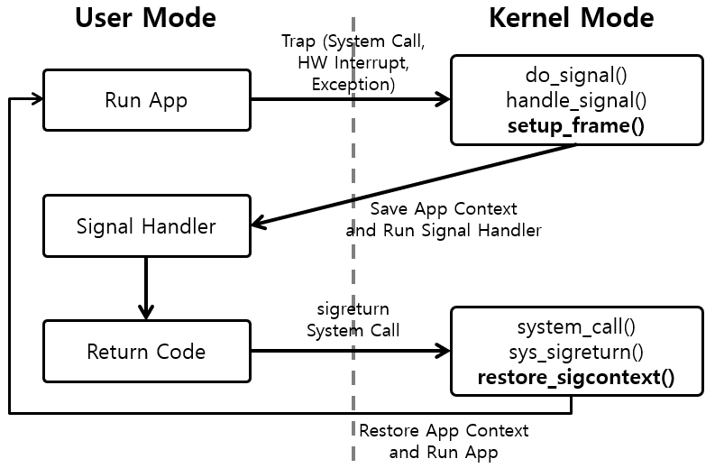

# 当执行 kill -9 pid 时， socket 也能正常关闭？

分析这个问题的起因，是因为在测试 TCP keep-alive 机制时，当进程被 ```kill -9`` 后，依然会走正常的挥手断开流程。而不是直接发RST等其他操作。所以怀疑是操作系统在回收资源时，对 socket 触发了 close 操作。

本文准备以 kill -9 时 TCP 正常断开连接的分析为入手点，来梳理下 linux 中信号的处理流程。

signal 的大体处理逻辑如下：



因为 SIGKILL 不会被应用程序捕捉，所以其处理函数都是在内核里边。

<br>

## 1. 在进入内核之前
----
<br>

```kill ``` 这个命令，本身是一个 shell 程序，而不是内核的部分。这个命令的实现在 [coreutils](http://www.maizure.org/projects/decoded-gnu-coreutils/) 里边。这我们不打算深入 coreutils 这个工程。只是大略看下 [kill](http://www.maizure.org/projects/decoded-gnu-coreutils/kill.html) 程序都干了什么，如何跟操作系统交互的。其调用栈如下：

``` cpp
    main() -> send_signals() -> kill()
```

其中 kill() 是系统调用，也就是给进程发信号。

> The kill() system call can be used to send any signal to any process group or process.

接下来就是内核里边的 kill() 的实现了。

<br>

## 2. linux 进程的 PCB ： task_struct
----
<br>

在分析 signal 处理之前，先看一下进程管理的资源存在哪里。

因为进程创建的 socket， 进程收到的 signal， 等， 都算是进程相关的资源。这写资源都保存在 ```task_struct``` 这个结构里边。也是是进程的PCB。这个结构包含了一个进程的所有信息，我们只看跟 signal 和 socket 相关的信息。

``` cpp
struct task_struct {
	/* -1 unrunnable, 0 runnable, >0 stopped: */
	volatile long			state;

    /* Signal handlers: */
	struct signal_struct		*signal;            // 进程的信号
	struct sighand_struct		*sighand;           // 进程的信号处理函数
	sigset_t			blocked;                    // 屏蔽信号的 掩码
	sigset_t			real_blocked;               // 临时屏蔽信号的掩码
	/* Restored if set_restore_sigmask() was used: */
	sigset_t			saved_sigmask;
	struct sigpending		pending;                // 待处理的信号， 这个是个list
	unsigned long			sas_ss_sp;
	size_t				sas_ss_size;
	unsigned int			sas_ss_flags;

    /* Open file information: */
	struct files_struct		*files;
};
```

我们打开的 socket 就保存在 ```files``` 里边, file_struct 的结构如下：

``` cpp
struct fdtable {
	unsigned int max_fds;
	struct file __rcu **fd;      /* current fd array */
	unsigned long *close_on_exec;
	unsigned long *open_fds;
	unsigned long *full_fds_bits;
	struct rcu_head rcu;
};
```

fdtable 中的 fd 是一个数组，我们打开的socket 的 file descriptor就是这个数组的下标。

<br>

task_struct 的是在进程被创建的时候被分配的， 而一个进程的创建大体上是从 fork 开始的，fork子进程会复制一个进程的所有资源，同时分配新的pid。创建逻辑可以参照内核中的 ```https://elixir.bootlin.com/linux/v4.19.180/source/kernel/fork.c#L2187``` 中的相关逻辑。

``` cpp
_do_fork()
    |
    | --> copy_process()
                |
                | -->  dup_task_struct()  // 创建 task_struct
                | -->  alloc_pid()
                | -->  ......
```

<br>

## 2. kill 的内核处理
----
<br>

kill 的系统调用在 [singal.c:3286](https://elixir.bootlin.com/linux/v4.19.180/source/kernel/signal.c#L3286) 里边

最终会调用到 ```int __send_signal()``` 这个函数，最终的做法，就是把信号放到pending 队列里边，然后唤醒一个进程来处理这个信号。

注意 SIGKILL 的信号并没有投递到进程的信号处理函数，而是直接标记进程退出了。

``` cpp
static void complete_signal(int sig, struct task_struct *p, enum pid_type type)
{
	struct signal_struct *signal = p->signal;
	struct task_struct *t;

	/*
	 * Now find a thread we can wake up to take the signal off the queue.
	 *
	 * If the main thread wants the signal, it gets first crack.
	 * Probably the least surprising to the average bear.
	 */
	if (wants_signal(sig, p))
		t = p;
	else if ((type == PIDTYPE_PID) || thread_group_empty(p))
		/*
		 * There is just one thread and it does not need to be woken.
		 * It will dequeue unblocked signals before it runs again.
		 */
		return;
	else {
		/*
		 * Otherwise try to find a suitable thread.
		 */
		t = signal->curr_target;
		while (!wants_signal(sig, t)) {
			t = next_thread(t);
			if (t == signal->curr_target)
				/*
				 * No thread needs to be woken.
				 * Any eligible threads will see
				 * the signal in the queue soon.
				 */
				return;
		}
		signal->curr_target = t;
	}

	/*
	 * Found a killable thread.  If the signal will be fatal,
	 * then start taking the whole group down immediately.
	 */
	if (sig_fatal(p, sig) &&
	    !(signal->flags & SIGNAL_GROUP_EXIT) &&
	    !sigismember(&t->real_blocked, sig) &&
	    (sig == SIGKILL || !p->ptrace)) {
		/*
		 * This signal will be fatal to the whole group.
		 */
		if (!sig_kernel_coredump(sig)) {
			/*
			 * Start a group exit and wake everybody up.
			 * This way we don't have other threads
			 * running and doing things after a slower
			 * thread has the fatal signal pending.
			 */
			signal->flags = SIGNAL_GROUP_EXIT;
			signal->group_exit_code = sig;
			signal->group_stop_count = 0;
			t = p;
			do {
				task_clear_jobctl_pending(t, JOBCTL_PENDING_MASK);
				sigaddset(&t->pending.signal, SIGKILL);
				signal_wake_up(t, 1);
			} while_each_thread(p, t);
			return;
		}
	}

	/*
	 * The signal is already in the shared-pending queue.
	 * Tell the chosen thread to wake up and dequeue it.
	 */
	signal_wake_up(t, sig == SIGKILL);
	return;
}
```

可以看到对进程标记了 SIGNAL_GROUP_EXIT， 然后进程退出的处理函数是在 ```/kernal/exit.c```

``` cpp
/*
 * Take down every thread in the group.  This is called by fatal signals
 * as well as by sys_exit_group (below).
 */
void
do_group_exit(int exit_code)
{
	struct signal_struct *sig = current->signal;

	BUG_ON(exit_code & 0x80); /* core dumps don't get here */

	if (signal_group_exit(sig))
		exit_code = sig->group_exit_code;
	else if (!thread_group_empty(current)) {
		struct sighand_struct *const sighand = current->sighand;

		spin_lock_irq(&sighand->siglock);
		if (signal_group_exit(sig))
			/* Another thread got here before we took the lock.  */
			exit_code = sig->group_exit_code;
		else {
			sig->group_exit_code = exit_code;
			sig->flags = SIGNAL_GROUP_EXIT;
			zap_other_threads(current);
		}
		spin_unlock_irq(&sighand->siglock);
	}

	do_exit(exit_code);
	/* NOTREACHED */
}
```

而最终的退出函数是在 ```void __noreturn do_exit(long code)```, 里边有资源回收文件的逻辑：

``` cpp
do_exit()
    |
    | -> exit_xxx() 
    | -> exit_fs()
            |
            | -> put_files_struct() //fs/file.c#L413
                    |
                    | -> close_files(files)
```

其中关闭 socket 的操作就在 close_files 里边 ( [Where does Linux kernel do process and TCP connections cleanup after process dies](https://stackoverflow.com/questions/4438146/where-does-linux-kernel-do-process-and-tcp-connections-cleanup-after-process-die))：
```
close_files() loops over all file descriptors the process has open (which includes all sockets), calling filp_close() on each one, which calls fput() on the struct file object. When the last reference to the struct file has been put, fput() calls the file object's .release() method, which for sockets, is the sock_close() function in net/socket.c.
```

<br>

## 3. socket 关闭
----
<br>

在 close_files 里边会调用fput 来关闭具体的对象。
``` cpp
/* the real guts of fput() - releasing the last reference to file
 */
static void __fput(struct file *file)
{
    ...

	if (file->f_op->release)
		file->f_op->release(inode, file);
	
    ...

	dput(dentry);
	mntput(mnt);
out:
	file_free(file);
}
```

其中socket 的release handler 在 ```net/socket.c:140``` 里边定义：
``` cpp
static const struct file_operations socket_file_ops = {
	.owner =	THIS_MODULE,
	.llseek =	no_llseek,
	.read_iter =	sock_read_iter,
	.write_iter =	sock_write_iter,
	.poll =		sock_poll,
	.unlocked_ioctl = sock_ioctl,
#ifdef CONFIG_COMPAT
	.compat_ioctl = compat_sock_ioctl,
#endif
	.mmap =		sock_mmap,
	.release =	sock_close,     //  关闭socket
	.fasync =	sock_fasync,
	.sendpage =	sock_sendpage,
	.splice_write = generic_splice_sendpage,
	.splice_read =	sock_splice_read,
};
```

然后 sock_close 就是具体的关闭流程了，会根据 socket 当前的状态，确定是否发送 FIN 之类的。

<br><br><br>

## 参考文档
----

<br>

* [Coreutils code structure overview](http://www.maizure.org/projects/decoded-gnu-coreutils/)

* [coreutil source code line by line walkthrough](http://www.maizure.org/projects/decoded-gnu-coreutils/whoami_walkthrough.html)

* [Linux 下的 task_struct 结构体](https://blog.csdn.net/weixin_38239856/article/details/82112597)

* [Linux in Depth - 文件系统及 Socket 源码解析](http://jinke.me/2018-08-23-socket-and-linux-file-system/)

* [Linux信号机制](https://www.cxyzjd.com/article/u013298300/51214129)

* [从linux源码看socket的close](https://my.oschina.net/alchemystar/blog/1821680)