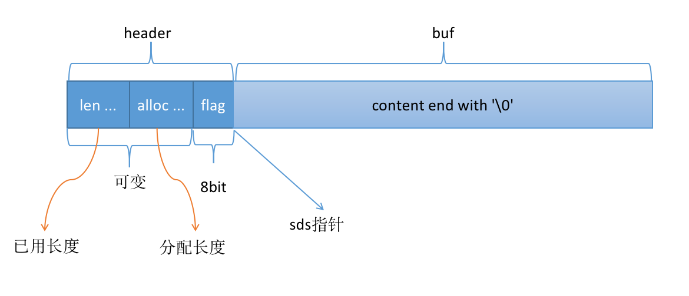

# sds 的实现

c 字符串是以 '\0' 结尾的一个连续内存空间。redis 频繁获取字符串长度，频繁修改的场景下，为了提高效率。是用了 sds (simple dynamic string) 来存储字符串和二进制内容。

<br>

## 1. sds 的结构
----
<br>

sds 中数据的存储仍然是以 '\0' 结尾的。区别于 c 字符串的是 sds 在内容之前添加了 header，来存储当前字符串的 meta 信息。并且其header 也是可变的。其逻辑结构如下图：



<br>

需要注意的是，sds 指针并没有指向整个结构的起始地址，而是仅仅指向了 content 的首地址。这样 sds 和 c 字符串基本功能就是一样的了。所以 c 字符串中的 strlen 同样适用于 sds。


<br>

## 2. sds 的可变 header
----
<br>

如上图所示，sds 的 header 不是固定的。根据能表示的 content 的长度不同， 有如下几种类型：

``` cpp
struct __attribute__ ((__packed__)) sdshdr5 {
    unsigned char flags; /* 3 lsb of type, and 5 msb of string length */
    char buf[];
};
struct __attribute__ ((__packed__)) sdshdr8 {
    uint8_t len; /* used */
    uint8_t alloc; /* excluding the header and null terminator */
    unsigned char flags; /* 3 lsb of type, 5 unused bits */
    char buf[];
};
struct __attribute__ ((__packed__)) sdshdr16 {
    uint16_t len; /* used */
    uint16_t alloc; /* excluding the header and null terminator */
    unsigned char flags; /* 3 lsb of type, 5 unused bits */
    char buf[];
};

......
```

那给定一个 sds 指针(指向的是 buf 的首地址)， 如果判断当前 sds 的 header，是哪一个？

关键就在 flags 字段了，因为 flags 字段是紧挨着 buf 的前一个字段，其固定是 1个字节(8bit)，所以 buf[-1], 指向的就是 flags 字段。

flags 字段的含义如下：

``` cpp
#define SDS_TYPE_5  0
#define SDS_TYPE_8  1
#define SDS_TYPE_16 2
#define SDS_TYPE_32 3
#define SDS_TYPE_64 4
```

分别对应不同的 header，这样我们就能后去到 header 信息了，然后就可以在 O(1) 复杂度下获取内容的长度。对于给定的一个 sds 指针，获取其长度的流程如下：

``` cpp
// 1. 获取 flags 字段
char flags = s[-1];

// 2. 获取header 大小
int header_type = flags & 7;
struct sdshdr header = switch(header_type) {return header_x}

// 3. 获取内容长度
int content_len = header->len;

```


<br>

## 3. sds 的扩容策略 和 步骤
----
<br>

sds 扩容发生在追加内容的时候，扩容的具体实现在 ```sdsMakeRoomFor``` 函数里边。

``` cpp
sds sdsMakeRoomFor(sds s, size_t addlen) {

    // .....

    // 根据是否到达预分配的临界值，使用不同的分配策略
    if (newlen < SDS_MAX_PREALLOC)
        newlen *= 2;
    else
        newlen += SDS_MAX_PREALLOC;

    type = sdsReqType(newlen);

    /* Don't use type 5: the user is appending to the string and type 5 is
     * not able to remember empty space, so sdsMakeRoomFor() must be called
     * at every appending operation. */
    if (type == SDS_TYPE_5) type = SDS_TYPE_8;

    // 下边是判断换头的操作
    hdrlen = sdsHdrSize(type);
    assert(hdrlen + newlen + 1 > len);  /* Catch size_t overflow */
    if (oldtype==type) {
        newsh = s_realloc_usable(sh, hdrlen+newlen+1, &usable);
        if (newsh == NULL) return NULL;
        s = (char*)newsh+hdrlen;
    } else {
        /* Since the header size changes, need to move the string forward,
         * and can't use realloc */
        newsh = s_malloc_usable(hdrlen+newlen+1, &usable);
        if (newsh == NULL) return NULL;
        memcpy((char*)newsh+hdrlen, s, len+1);
        s_free(sh);
        s = (char*)newsh+hdrlen;
        s[-1] = type;
        sdssetlen(s, len);
    }
    usable = usable-hdrlen-1;
    if (usable > sdsTypeMaxSize(type))
        usable = sdsTypeMaxSize(type);
    sdssetalloc(s, usable);
    return s;
}
```

sds 的内存扩容分两步：

1. 根据预分配阈值，分配内存，一般都会比 content 的实际 长度要大，以减少分配次数
2. 根据是否超出了 header 所能表示的长度，进行换头操作，以用更大的 header 表示。

<br>

## 4. sds 的 clear 操作
----
<br>

不同于 c 字符串，当数据清空时，需要释放内存。

因为 sds 有 header， 保存了已分配内存，和 已使用内存，所以使得 清空数据但不释放内存 成为了可能。

这也为上层调用者尽量减少内存分配提供了遍历，比如在 aof 中 aof buffer 的处理

``` cpp
/* Modify an sds string in-place to make it empty (zero length).
 * However all the existing buffer is not discarded but set as free space
 * so that next append operations will not require allocations up to the
 * number of bytes previously available. */
void sdsclear(sds s) {
    sdssetlen(s, 0);
    s[0] = '\0';
}

/* Re-use AOF buffer when it is small enough. The maximum comes from the
    * arena size of 4k minus some overhead (but is otherwise arbitrary). */
if ((sdslen(server.aof_buf)+sdsavail(server.aof_buf)) < 4000) {
    sdsclear(server.aof_buf);
} else {
    sdsfree(server.aof_buf);
    server.aof_buf = sdsempty();
}
```


<br><br><br>

## 参考资料
----
<br>

* redis-6.2.1 源码
* redis-doc